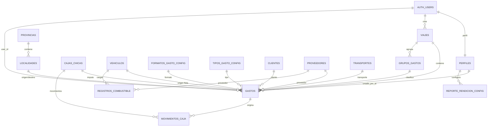

# DATABASE_SCHEMA_AND_RELATIONSHIPS.md

## Esquema y Relaciones de la Base de Datos — InfoGastos Districorr

**Versión:** 4.0  
**Fecha de consolidación:** 2026-05-12  
**Fuente:** exports reales del esquema de Supabase provistos en esta conversación: columnas agregadas, constraints por tabla, metadatos de foreign keys e índices públicos.

---

## 1. Alcance y criterio de verificación

Este documento consolida el **modelo físico real de la base de datos PostgreSQL** del proyecto InfoGastos. A diferencia de versiones preliminares, esta versión se apoya en metadatos exportados directamente desde Supabase y no en inferencias del frontend.

### Cobertura verificada

| Objeto | Cantidad verificada |
| --- | --- |
| Tablas públicas | 26 |
| Vistas públicas detectadas | 9 |
| Foreign Keys totales | 54 |
| Constraints de tabla | 108 |
| Índices públicos | 56 |
| CHECK constraints | 12 |
| UNIQUE constraints | 16 |

### Fuentes usadas

- `Supabase Snippet Aggregate Column Metadata as JSON.csv`
- `Supabase Snippet List Constraints by Table Schema.csv`
- `Supabase Snippet Foreign Key Metadata in Public Schema.csv`
- `Supabase Snippet List Public Index Definitions.csv`

---

## 2. Lectura ejecutiva del modelo

El esquema se organiza en siete dominios principales:

| Dominio | Tablas |
| --- | --- |
| Usuarios, permisos y notificaciones | `perfiles`, `usuario_formatos_permitidos`, `usuario_tipos_gasto_permitidos`, `notificaciones` |
| Rendiciones y gastos | `viajes`, `gastos`, `grupos_gastos`, `historial_aprobaciones_rendicion`, `historial_delegaciones`, `solicitudes_eliminacion` |
| Caja chica | `cajas_chicas`, `movimientos_caja`, `solicitudes_reposicion` |
| Configuración dinámica de formularios | `formatos_gasto_config`, `campos_formato_config`, `tipos_gasto_config` |
| Catálogos maestros | `clientes`, `proveedores`, `transportes`, `bancos` |
| Geografía | `provincias`, `localidades` |
| Flota | `vehiculos`, `vehiculo_asignaciones`, `registros_combustible` |
| Reportes | `reporte_rendicion_config` |

---

## 3. Hallazgos técnicos relevantes

1. **`gastos` es la tabla central del dominio** y concentra relaciones con rendiciones, caja chica, flota, formatos de carga, proveedores, clientes, transporte, geografía, grupos y trazabilidad de delegación.

2. **La regla de exclusividad de origen en `gastos` existe y está confirmada**, pero su definición física permite **cero o un origen**, no exactamente uno:

```sql
CHECK ((
CASE
    WHEN viaje_id IS NOT NULL THEN 1
    ELSE 0
END +
CASE
    WHEN caja_id IS NOT NULL THEN 1
    ELSE 0
END +
CASE
    WHEN vehiculo_id IS NOT NULL THEN 1
    ELSE 0
END) <= 1)
```

Esto significa que la base impide que un gasto pertenezca simultáneamente a rendición, caja y vehículo, pero **no obliga por sí sola** a que tenga al menos un origen.

3. **`gastos.user_id` posee dos foreign keys simultáneas**:
   - hacia `auth.users(id)` con `ON UPDATE CASCADE ON DELETE CASCADE`;
   - hacia `perfiles(id)` con `ON UPDATE CASCADE ON DELETE SET NULL`.

   Esta combinación está confirmada y conviene tratarla como un punto sensible en cualquier migración o cambio de ownership.

4. **`viajes.user_id` referencia directamente a `auth.users(id)`**, no a `perfiles(id)`. Esto contradice parte de la documentación preliminar generada antes de inspeccionar el esquema real.

5. **`gastos.viaje_id` usa `ON DELETE CASCADE`**. Eliminar una rendición elimina sus gastos asociados a nivel de FK.

6. **`reporte_rendicion_config` tiene un índice único parcial confirmado** que garantiza una única configuración default por usuario:

```sql
CREATE UNIQUE INDEX idx_reporte_rendicion_config_user_default_partial ON public.reporte_rendicion_config USING btree (user_id) WHERE (es_default = true)
```

7. **`tipo_gasto_id` en `gastos` es nullable (`YES`)** y su FK usa `ON DELETE SET NULL`. La obligatoriedad funcional del tipo de gasto, si existe, debe verificarse en RPCs, frontend o políticas adicionales.

---

## 4. Diagrama ERD simplificado



> Nota: el diagrama es conceptual y simplificado. La tabla de Foreign Keys de la sección 7 constituye la fuente exhaustiva de relaciones físicas.

---

## 5. Inventario de tablas públicas

| Tabla | Propósito funcional | Columnas | Constraints |
| --- | --- | --- | --- |
| `bancos` | Catálogo de bancos utilizados por campos/formularios o clasificación de gastos. | 4 | 2 |
| `cajas_chicas` | Fondos operativos asignados a responsables; almacena objetivo, umbral, saldo y deuda. | 9 | 2 |
| `campos_formato_config` | Definición dinámica de campos asociados a cada formato de gasto. | 11 | 2 |
| `clientes` | Catálogo de clientes referidos, asociado a usuarios y trazabilidad de creador. | 5 | 5 |
| `formatos_gasto_config` | Plantillas o formatos de carga de gastos. | 5 | 3 |
| `gastos` | Tabla central de gastos; integra rendiciones, caja, flota, delegación, revisión y atributos operativos. | 39 | 21 |
| `grupos_gastos` | Agrupaciones personalizadas de gastos dentro de una rendición. | 5 | 3 |
| `historial_aprobaciones_rendicion` | Registro histórico de decisiones de aprobación/rechazo sobre rendiciones. | 6 | 4 |
| `historial_delegaciones` | Registro histórico del flujo de delegación de gastos. | 8 | 5 |
| `localidades` | Catálogo geográfico de localidades con coordenadas opcionales. | 5 | 3 |
| `movimientos_caja` | Libro de movimientos de caja chica: gastos, reposiciones y ajustes. | 10 | 5 |
| `notificaciones` | Notificaciones internas para usuarios. | 7 | 2 |
| `perfiles` | Extensión de usuarios con rol, puesto, email y formato predeterminado. | 7 | 3 |
| `proveedores` | Catálogo de proveedores. | 6 | 4 |
| `provincias` | Catálogo de provincias. | 2 | 2 |
| `registros_combustible` | Cargas de combustible asociadas a vehículos, conductor y proveedor. | 11 | 7 |
| `reporte_rendicion_config` | Configuraciones personalizadas de reportes de rendición. | 12 | 3 |
| `solicitudes_eliminacion` | Solicitudes para eliminar gastos y su revisión administrativa. | 9 | 5 |
| `solicitudes_reposicion` | Solicitudes de reposición de cajas chicas y su revisión administrativa. | 9 | 5 |
| `tipos_gasto_config` | Catálogo configurable de tipos de gasto. | 9 | 2 |
| `transportes` | Catálogo de medios/proveedores de transporte. | 3 | 2 |
| `usuario_formatos_permitidos` | Pivote de permisos por usuario para formatos de gasto. | 3 | 3 |
| `usuario_tipos_gasto_permitidos` | Pivote de permisos por usuario para tipos de gasto. | 3 | 3 |
| `vehiculo_asignaciones` | Pivote de asignaciones entre vehículos y usuarios. | 4 | 4 |
| `vehiculos` | Maestro de vehículos de flota. | 9 | 3 |
| `viajes` | Rendiciones o viajes; contenedor operativo de gastos. | 14 | 4 |

---

## 6. Diccionario de datos completo por tabla

### 6.1. `bancos`

**Propósito:** Catálogo de bancos utilizados por campos/formularios o clasificación de gastos.

| # | Columna | Tipo | UDT | Nullable | Default |
| --- | --- | --- | --- | --- | --- |
| 1 | `id` | bigint | `int8` | NO | `nextval('bancos_id_seq'::regclass)` |
| 2 | `created_at` | timestamp with time zone | `timestamptz` | NO | `now()` |
| 3 | `nombre` | text | `text` | NO |  |
| 4 | `color_hex` | text | `text` | YES |  |

**Constraints confirmadas:**

| Constraint | Tipo | Definición |
| --- | --- | --- |
| `bancos_nombre_key` | UNIQUE | `UNIQUE (nombre)` |
| `bancos_pkey` | PRIMARY KEY | `PRIMARY KEY (id)` |

**Índices confirmados:**

| Índice | Definición |
| --- | --- |
| `bancos_nombre_key` | `CREATE UNIQUE INDEX bancos_nombre_key ON public.bancos USING btree (nombre)` |
| `bancos_pkey` | `CREATE UNIQUE INDEX bancos_pkey ON public.bancos USING btree (id)` |

### 6.2. `cajas_chicas`

**Propósito:** Fondos operativos asignados a responsables; almacena objetivo, umbral, saldo y deuda.

| # | Columna | Tipo | UDT | Nullable | Default |
| --- | --- | --- | --- | --- | --- |
| 1 | `id` | bigint | `int8` | NO | `nextval('cajas_chicas_id_seq'::regclass)` |
| 2 | `created_at` | timestamp with time zone | `timestamptz` | NO | `now()` |
| 3 | `nombre` | text | `text` | NO |  |
| 4 | `responsable_id` | uuid | `uuid` | NO |  |
| 5 | `monto_objetivo` | numeric | `numeric` | NO | `0` |
| 6 | `umbral_reposicion` | numeric | `numeric` | NO | `0` |
| 7 | `saldo_actual` | numeric | `numeric` | NO | `0` |
| 8 | `deuda_responsable` | numeric | `numeric` | NO | `0` |
| 9 | `activo` | boolean | `bool` | NO | `true` |

**Constraints confirmadas:**

| Constraint | Tipo | Definición |
| --- | --- | --- |
| `cajas_chicas_pkey` | PRIMARY KEY | `PRIMARY KEY (id)` |
| `cajas_chicas_responsable_id_fkey` | FOREIGN KEY | `FOREIGN KEY (responsable_id) REFERENCES perfiles(id)` |

**Índices confirmados:**

| Índice | Definición |
| --- | --- |
| `cajas_chicas_pkey` | `CREATE UNIQUE INDEX cajas_chicas_pkey ON public.cajas_chicas USING btree (id)` |
| `idx_cajas_chicas_responsable_id` | `CREATE INDEX idx_cajas_chicas_responsable_id ON public.cajas_chicas USING btree (responsable_id)` |

### 6.3. `campos_formato_config`

**Propósito:** Definición dinámica de campos asociados a cada formato de gasto.

| # | Columna | Tipo | UDT | Nullable | Default |
| --- | --- | --- | --- | --- | --- |
| 1 | `id` | bigint | `int8` | NO | `nextval('campos_formato_config_id_seq'::regclass)` |
| 2 | `created_at` | timestamp with time zone | `timestamptz` | NO | `now()` |
| 3 | `formato_id` | bigint | `int8` | NO |  |
| 4 | `nombre_campo_tecnico` | text | `text` | NO |  |
| 5 | `etiqueta_visible` | text | `text` | NO |  |
| 6 | `tipo_dato` | text | `text` | NO |  |
| 7 | `es_obligatorio` | boolean | `bool` | NO | `false` |
| 8 | `opciones_selector` | jsonb | `jsonb` | YES |  |
| 9 | `orden_visualizacion` | integer | `int4` | NO | `0` |
| 10 | `tipo_input` | text | `text` | YES |  |
| 11 | `valor_por_defecto` | text | `text` | YES |  |

**Constraints confirmadas:**

| Constraint | Tipo | Definición |
| --- | --- | --- |
| `campos_formato_config_formato_id_fkey` | FOREIGN KEY | `FOREIGN KEY (formato_id) REFERENCES formatos_gasto_config(id) ON DELETE CASCADE` |
| `campos_formato_config_pkey` | PRIMARY KEY | `PRIMARY KEY (id)` |

**Índices confirmados:**

| Índice | Definición |
| --- | --- |
| `campos_formato_config_pkey` | `CREATE UNIQUE INDEX campos_formato_config_pkey ON public.campos_formato_config USING btree (id)` |

### 6.4. `clientes`

**Propósito:** Catálogo de clientes referidos, asociado a usuarios y trazabilidad de creador.

| # | Columna | Tipo | UDT | Nullable | Default |
| --- | --- | --- | --- | --- | --- |
| 1 | `id` | bigint | `int8` | NO | `nextval('clientes_referidos_id_seq'::regclass)` |
| 2 | `ultima_vez_usado` | timestamp with time zone | `timestamptz` | YES | `now()` |
| 3 | `user_id` | uuid | `uuid` | YES | `auth.uid()` |
| 4 | `nombre_cliente` | text | `text` | NO |  |
| 5 | `creado_por_id` | uuid | `uuid` | YES |  |

**Constraints confirmadas:**

| Constraint | Tipo | Definición |
| --- | --- | --- |
| `clientes_creado_por_id_fkey` | FOREIGN KEY | `FOREIGN KEY (creado_por_id) REFERENCES perfiles(id) ON DELETE SET NULL` |
| `clientes_referidos_pkey` | PRIMARY KEY | `PRIMARY KEY (id)` |
| `clientes_referidos_usuario_id_key` | UNIQUE | `UNIQUE (id)` |
| `clientes_referidos_usuario_user_id_fkey` | FOREIGN KEY | `FOREIGN KEY (user_id) REFERENCES auth.users(id) ON DELETE CASCADE` |
| `unique_user_cliente_referido` | UNIQUE | `UNIQUE (user_id, nombre_cliente)` |

**Índices confirmados:**

| Índice | Definición |
| --- | --- |
| `clientes_referidos_pkey` | `CREATE UNIQUE INDEX clientes_referidos_pkey ON public.clientes USING btree (id)` |
| `clientes_referidos_usuario_id_key` | `CREATE UNIQUE INDEX clientes_referidos_usuario_id_key ON public.clientes USING btree (id)` |
| `unique_user_cliente_referido` | `CREATE UNIQUE INDEX unique_user_cliente_referido ON public.clientes USING btree (user_id, nombre_cliente)` |

### 6.5. `formatos_gasto_config`

**Propósito:** Plantillas o formatos de carga de gastos.

| # | Columna | Tipo | UDT | Nullable | Default |
| --- | --- | --- | --- | --- | --- |
| 1 | `id` | bigint | `int8` | NO | `nextval('formatos_gasto_config_id_seq'::regclass)` |
| 2 | `created_at` | timestamp with time zone | `timestamptz` | NO | `now()` |
| 3 | `nombre_formato` | text | `text` | NO |  |
| 4 | `descripcion` | text | `text` | YES |  |
| 5 | `activo` | boolean | `bool` | NO | `true` |

**Constraints confirmadas:**

| Constraint | Tipo | Definición |
| --- | --- | --- |
| `formatos_gasto_config_id_key` | UNIQUE | `UNIQUE (id)` |
| `formatos_gasto_config_nombre_formato_key` | UNIQUE | `UNIQUE (nombre_formato)` |
| `formatos_gasto_config_pkey` | PRIMARY KEY | `PRIMARY KEY (id)` |

**Índices confirmados:**

| Índice | Definición |
| --- | --- |
| `formatos_gasto_config_id_key` | `CREATE UNIQUE INDEX formatos_gasto_config_id_key ON public.formatos_gasto_config USING btree (id)` |
| `formatos_gasto_config_nombre_formato_key` | `CREATE UNIQUE INDEX formatos_gasto_config_nombre_formato_key ON public.formatos_gasto_config USING btree (nombre_formato)` |
| `formatos_gasto_config_pkey` | `CREATE UNIQUE INDEX formatos_gasto_config_pkey ON public.formatos_gasto_config USING btree (id)` |

### 6.6. `gastos`

**Propósito:** Tabla central de gastos; integra rendiciones, caja, flota, delegación, revisión y atributos operativos.

| # | Columna | Tipo | UDT | Nullable | Default |
| --- | --- | --- | --- | --- | --- |
| 1 | `id` | bigint | `int8` | NO | `nextval('gastos_id_seq'::regclass)` |
| 2 | `created_at` | timestamp with time zone | `timestamptz` | NO | `now()` |
| 3 | `user_id` | uuid | `uuid` | YES | `auth.uid()` |
| 4 | `formato_id` | bigint | `int8` | YES |  |
| 5 | `fecha_gasto` | date | `date` | NO | `now()` |
| 6 | `monto_total` | numeric | `numeric` | NO |  |
| 7 | `moneda` | text | `text` | NO | `'ARS'::text` |
| 8 | `descripcion_general` | text | `text` | YES |  |
| 9 | `datos_adicionales` | jsonb | `jsonb` | YES |  |
| 10 | `factura_url` | text | `text` | YES |  |
| 11 | `numero_factura` | text | `text` | YES |  |
| 12 | `viaje_id` | bigint | `int8` | YES |  |
| 13 | `tipo_gasto_id` | bigint | `int8` | YES |  |
| 14 | `cliente_referido` | text | `text` | YES |  |
| 15 | `adelanto_especifico_aplicado` | numeric | `numeric` | YES |  |
| 16 | `monto_iva` | numeric | `numeric` | YES |  |
| 17 | `cliente_id` | bigint | `int8` | YES |  |
| 18 | `transporte_id` | bigint | `int8` | YES |  |
| 19 | `provincia_texto_legacy` | text | `text` | YES |  |
| 20 | `proveedor_id` | bigint | `int8` | YES |  |
| 21 | `caja_id` | bigint | `int8` | YES |  |
| 22 | `creado_por_id` | uuid | `uuid` | YES | `auth.uid()` |
| 23 | `estado_delegacion` | text | `text` | NO | `'directo'::text` |
| 24 | `grupo_id` | bigint | `int8` | YES |  |
| 25 | `estado_revision` | text | `text` | YES | `'en_revision'::text` |
| 26 | `comentario_revision` | text | `text` | YES |  |
| 27 | `transporte_origen` | text | `text` | YES |  |
| 28 | `transporte_destino` | text | `text` | YES |  |
| 29 | `vehiculo_id` | bigint | `int8` | YES |  |
| 30 | `localidad_origen_id` | bigint | `int8` | YES |  |
| 31 | `localidad_destino_id` | bigint | `int8` | YES |  |
| 32 | `provincia_id` | bigint | `int8` | YES |  |
| 33 | `provincia` | text | `text` | YES |  |
| 34 | `paciente_referido` | text | `text` | YES |  |
| 35 | `nombre_chofer` | text | `text` | YES |  |
| 36 | `es_revisado` | boolean | `bool` | YES | `false` |
| 37 | `provincia_origen_id` | bigint | `int8` | YES |  |
| 38 | `provincia_destino_id` | bigint | `int8` | YES |  |
| 39 | `origen_gasto` | text | `text` | YES |  |

**Constraints confirmadas:**

| Constraint | Tipo | Definición |
| --- | --- | --- |
| `chk_estado_delegacion` | CHECK | `CHECK (estado_delegacion = ANY (ARRAY['directo'::text, 'pendiente_aceptacion'::text, 'aceptado'::text, 'rechazado'::text]))` |
| `chk_gasto_origen_exclusivo_v2` | CHECK | `CHECK (( CASE WHEN viaje_id IS NOT NULL THEN 1 ELSE 0 END + CASE WHEN caja_id IS NOT NULL THEN 1 ELSE 0 END + CASE WHEN vehiculo_id IS NOT NULL THEN 1 ELSE 0 END) <= 1)` |
| `fk_gastos_grupo_id` | FOREIGN KEY | `FOREIGN KEY (grupo_id) REFERENCES grupos_gastos(id) ON DELETE SET NULL` |
| `fk_gastos_provincia` | FOREIGN KEY | `FOREIGN KEY (provincia_id) REFERENCES provincias(id) ON DELETE SET NULL` |
| `fk_gastos_provincia_destino` | FOREIGN KEY | `FOREIGN KEY (provincia_destino_id) REFERENCES provincias(id) ON DELETE SET NULL` |
| `fk_gastos_provincia_origen` | FOREIGN KEY | `FOREIGN KEY (provincia_origen_id) REFERENCES provincias(id) ON DELETE SET NULL` |
| `fk_gastos_vehiculo_id` | FOREIGN KEY | `FOREIGN KEY (vehiculo_id) REFERENCES vehiculos(id) ON DELETE SET NULL` |
| `fk_localidad_destino` | FOREIGN KEY | `FOREIGN KEY (localidad_destino_id) REFERENCES localidades(id) ON DELETE SET NULL` |
| `fk_localidad_origen` | FOREIGN KEY | `FOREIGN KEY (localidad_origen_id) REFERENCES localidades(id) ON DELETE SET NULL` |
| `gastos_caja_id_fkey` | FOREIGN KEY | `FOREIGN KEY (caja_id) REFERENCES cajas_chicas(id) ON DELETE SET NULL` |
| `gastos_cliente_id_fkey` | FOREIGN KEY | `FOREIGN KEY (cliente_id) REFERENCES clientes(id) ON DELETE SET NULL` |
| `gastos_creado_por_id_fkey` | FOREIGN KEY | `FOREIGN KEY (creado_por_id) REFERENCES perfiles(id) ON DELETE SET NULL` |
| `gastos_estado_revision_check` | CHECK | `CHECK (estado_revision = ANY (ARRAY['en_revision'::text, 'aprobado'::text, 'observado'::text]))` |
| `gastos_formato_id_fkey` | FOREIGN KEY | `FOREIGN KEY (formato_id) REFERENCES formatos_gasto_config(id)` |
| `gastos_pkey` | PRIMARY KEY | `PRIMARY KEY (id)` |
| `gastos_proveedor_id_fkey` | FOREIGN KEY | `FOREIGN KEY (proveedor_id) REFERENCES proveedores(id) ON DELETE SET NULL` |
| `gastos_tipo_gasto_id_fkey` | FOREIGN KEY | `FOREIGN KEY (tipo_gasto_id) REFERENCES tipos_gasto_config(id) ON DELETE SET NULL` |
| `gastos_transporte_id_fkey` | FOREIGN KEY | `FOREIGN KEY (transporte_id) REFERENCES transportes(id) ON DELETE SET NULL` |
| `gastos_user_id_fkey` | FOREIGN KEY | `FOREIGN KEY (user_id) REFERENCES auth.users(id) ON UPDATE CASCADE ON DELETE CASCADE` |
| `gastos_user_id_fkey_to_perfiles` | FOREIGN KEY | `FOREIGN KEY (user_id) REFERENCES perfiles(id) ON UPDATE CASCADE ON DELETE SET NULL` |
| `gastos_viaje_id_fkey` | FOREIGN KEY | `FOREIGN KEY (viaje_id) REFERENCES viajes(id) ON DELETE CASCADE` |
| `unique_factura_proveedor` | UNIQUE | `UNIQUE (numero_factura, proveedor_id)` |

**Índices confirmados:**

| Índice | Definición |
| --- | --- |
| `gastos_pkey` | `CREATE UNIQUE INDEX gastos_pkey ON public.gastos USING btree (id)` |
| `idx_gastos_cliente_id` | `CREATE INDEX idx_gastos_cliente_id ON public.gastos USING btree (cliente_id)` |
| `idx_gastos_creado_por_id` | `CREATE INDEX idx_gastos_creado_por_id ON public.gastos USING btree (creado_por_id)` |
| `idx_gastos_fecha_gasto` | `CREATE INDEX idx_gastos_fecha_gasto ON public.gastos USING btree (fecha_gasto)` |
| `idx_gastos_formato_id` | `CREATE INDEX idx_gastos_formato_id ON public.gastos USING btree (formato_id)` |
| `idx_gastos_proveedor_id` | `CREATE INDEX idx_gastos_proveedor_id ON public.gastos USING btree (proveedor_id)` |
| `idx_gastos_tipo_gasto_id` | `CREATE INDEX idx_gastos_tipo_gasto_id ON public.gastos USING btree (tipo_gasto_id)` |
| `idx_gastos_transporte_id` | `CREATE INDEX idx_gastos_transporte_id ON public.gastos USING btree (transporte_id)` |
| `idx_gastos_user_id` | `CREATE INDEX idx_gastos_user_id ON public.gastos USING btree (user_id)` |
| `idx_gastos_viaje_id` | `CREATE INDEX idx_gastos_viaje_id ON public.gastos USING btree (viaje_id)` |
| `unique_factura_proveedor` | `CREATE UNIQUE INDEX unique_factura_proveedor ON public.gastos USING btree (numero_factura, proveedor_id)` |

### 6.7. `grupos_gastos`

**Propósito:** Agrupaciones personalizadas de gastos dentro de una rendición.

| # | Columna | Tipo | UDT | Nullable | Default |
| --- | --- | --- | --- | --- | --- |
| 1 | `id` | bigint | `int8` | NO | `nextval('grupos_gastos_id_seq'::regclass)` |
| 2 | `created_at` | timestamp with time zone | `timestamptz` | NO | `now()` |
| 3 | `nombre_grupo` | text | `text` | NO |  |
| 4 | `viaje_id` | bigint | `int8` | NO |  |
| 5 | `creado_por_id` | uuid | `uuid` | YES |  |

**Constraints confirmadas:**

| Constraint | Tipo | Definición |
| --- | --- | --- |
| `grupos_gastos_creado_por_id_fkey` | FOREIGN KEY | `FOREIGN KEY (creado_por_id) REFERENCES perfiles(id) ON DELETE SET NULL` |
| `grupos_gastos_pkey` | PRIMARY KEY | `PRIMARY KEY (id)` |
| `grupos_gastos_viaje_id_fkey` | FOREIGN KEY | `FOREIGN KEY (viaje_id) REFERENCES viajes(id) ON DELETE CASCADE` |

**Índices confirmados:**

| Índice | Definición |
| --- | --- |
| `grupos_gastos_pkey` | `CREATE UNIQUE INDEX grupos_gastos_pkey ON public.grupos_gastos USING btree (id)` |

### 6.8. `historial_aprobaciones_rendicion`

**Propósito:** Registro histórico de decisiones de aprobación/rechazo sobre rendiciones.

| # | Columna | Tipo | UDT | Nullable | Default |
| --- | --- | --- | --- | --- | --- |
| 1 | `id` | bigint | `int8` | NO | `nextval('historial_aprobaciones_rendicion_id_seq'::regclass)` |
| 2 | `created_at` | timestamp with time zone | `timestamptz` | NO | `now()` |
| 3 | `viaje_id` | bigint | `int8` | YES |  |
| 4 | `admin_id` | uuid | `uuid` | YES |  |
| 5 | `decision` | text | `text` | NO |  |
| 6 | `comentarios` | text | `text` | YES |  |

**Constraints confirmadas:**

| Constraint | Tipo | Definición |
| --- | --- | --- |
| `chk_decision` | CHECK | `CHECK (decision = ANY (ARRAY['aprobado'::text, 'rechazado'::text]))` |
| `historial_aprobaciones_rendicion_admin_id_fkey` | FOREIGN KEY | `FOREIGN KEY (admin_id) REFERENCES perfiles(id) ON DELETE SET NULL` |
| `historial_aprobaciones_rendicion_pkey` | PRIMARY KEY | `PRIMARY KEY (id)` |
| `historial_aprobaciones_rendicion_viaje_id_fkey` | FOREIGN KEY | `FOREIGN KEY (viaje_id) REFERENCES viajes(id) ON DELETE SET NULL` |

**Índices confirmados:**

| Índice | Definición |
| --- | --- |
| `historial_aprobaciones_rendicion_pkey` | `CREATE UNIQUE INDEX historial_aprobaciones_rendicion_pkey ON public.historial_aprobaciones_rendicion USING btree (id)` |

### 6.9. `historial_delegaciones`

**Propósito:** Registro histórico del flujo de delegación de gastos.

| # | Columna | Tipo | UDT | Nullable | Default |
| --- | --- | --- | --- | --- | --- |
| 1 | `id` | bigint | `int8` | NO | `nextval('historial_delegaciones_id_seq'::regclass)` |
| 2 | `created_at` | timestamp with time zone | `timestamptz` | NO | `now()` |
| 3 | `gasto_id` | bigint | `int8` | NO |  |
| 4 | `delegador_id` | uuid | `uuid` | NO |  |
| 5 | `receptor_id` | uuid | `uuid` | NO |  |
| 6 | `decision` | text | `text` | NO | `'pendiente'::text` |
| 7 | `motivo_rechazo` | text | `text` | YES |  |
| 8 | `fecha_decision` | timestamp with time zone | `timestamptz` | YES |  |

**Constraints confirmadas:**

| Constraint | Tipo | Definición |
| --- | --- | --- |
| `historial_delegaciones_decision_check` | CHECK | `CHECK (decision = ANY (ARRAY['aceptado'::text, 'rechazado'::text, 'pendiente'::text]))` |
| `historial_delegaciones_delegador_id_fkey` | FOREIGN KEY | `FOREIGN KEY (delegador_id) REFERENCES perfiles(id)` |
| `historial_delegaciones_gasto_id_fkey` | FOREIGN KEY | `FOREIGN KEY (gasto_id) REFERENCES gastos(id) ON DELETE CASCADE` |
| `historial_delegaciones_pkey` | PRIMARY KEY | `PRIMARY KEY (id)` |
| `historial_delegaciones_receptor_id_fkey` | FOREIGN KEY | `FOREIGN KEY (receptor_id) REFERENCES perfiles(id)` |

**Índices confirmados:**

| Índice | Definición |
| --- | --- |
| `historial_delegaciones_pkey` | `CREATE UNIQUE INDEX historial_delegaciones_pkey ON public.historial_delegaciones USING btree (id)` |

### 6.10. `localidades`

**Propósito:** Catálogo geográfico de localidades con coordenadas opcionales.

| # | Columna | Tipo | UDT | Nullable | Default |
| --- | --- | --- | --- | --- | --- |
| 1 | `id` | bigint | `int8` | NO | `nextval('localidades_id_seq'::regclass)` |
| 2 | `nombre` | text | `text` | NO |  |
| 3 | `provincia_id` | bigint | `int8` | NO |  |
| 4 | `lat` | numeric | `numeric` | YES |  |
| 5 | `lng` | numeric | `numeric` | YES |  |

**Constraints confirmadas:**

| Constraint | Tipo | Definición |
| --- | --- | --- |
| `fk_provincia` | FOREIGN KEY | `FOREIGN KEY (provincia_id) REFERENCES provincias(id) ON DELETE CASCADE` |
| `localidades_pkey` | PRIMARY KEY | `PRIMARY KEY (id)` |
| `unique_localidad_por_provincia` | UNIQUE | `UNIQUE (nombre, provincia_id)` |

**Índices confirmados:**

| Índice | Definición |
| --- | --- |
| `localidades_pkey` | `CREATE UNIQUE INDEX localidades_pkey ON public.localidades USING btree (id)` |
| `unique_localidad_por_provincia` | `CREATE UNIQUE INDEX unique_localidad_por_provincia ON public.localidades USING btree (nombre, provincia_id)` |

### 6.11. `movimientos_caja`

**Propósito:** Libro de movimientos de caja chica: gastos, reposiciones y ajustes.

| # | Columna | Tipo | UDT | Nullable | Default |
| --- | --- | --- | --- | --- | --- |
| 1 | `id` | bigint | `int8` | NO | `nextval('movimientos_caja_id_seq'::regclass)` |
| 2 | `created_at` | timestamp with time zone | `timestamptz` | NO | `now()` |
| 3 | `caja_id` | bigint | `int8` | NO |  |
| 4 | `gasto_id` | bigint | `int8` | YES |  |
| 5 | `tipo_movimiento` | text | `text` | NO |  |
| 6 | `monto` | numeric | `numeric` | NO |  |
| 7 | `saldo_anterior` | numeric | `numeric` | NO |  |
| 8 | `saldo_posterior` | numeric | `numeric` | NO |  |
| 9 | `descripcion` | text | `text` | YES |  |
| 10 | `realizado_por_id` | uuid | `uuid` | NO |  |

**Constraints confirmadas:**

| Constraint | Tipo | Definición |
| --- | --- | --- |
| `movimientos_caja_caja_id_fkey` | FOREIGN KEY | `FOREIGN KEY (caja_id) REFERENCES cajas_chicas(id)` |
| `movimientos_caja_gasto_id_fkey` | FOREIGN KEY | `FOREIGN KEY (gasto_id) REFERENCES gastos(id) ON DELETE SET NULL` |
| `movimientos_caja_pkey` | PRIMARY KEY | `PRIMARY KEY (id)` |
| `movimientos_caja_realizado_por_id_fkey` | FOREIGN KEY | `FOREIGN KEY (realizado_por_id) REFERENCES perfiles(id)` |
| `movimientos_caja_tipo_movimiento_check` | CHECK | `CHECK (tipo_movimiento = ANY (ARRAY['gasto'::text, 'reposicion'::text, 'ajuste_manual'::text]))` |

**Índices confirmados:**

| Índice | Definición |
| --- | --- |
| `movimientos_caja_pkey` | `CREATE UNIQUE INDEX movimientos_caja_pkey ON public.movimientos_caja USING btree (id)` |

### 6.12. `notificaciones`

**Propósito:** Notificaciones internas para usuarios.

| # | Columna | Tipo | UDT | Nullable | Default |
| --- | --- | --- | --- | --- | --- |
| 1 | `id` | bigint | `int8` | NO | `nextval('notificaciones_id_seq'::regclass)` |
| 2 | `user_id` | uuid | `uuid` | NO |  |
| 3 | `mensaje` | text | `text` | NO |  |
| 4 | `leido` | boolean | `bool` | NO | `false` |
| 5 | `link_a` | text | `text` | YES |  |
| 6 | `tipo` | text | `text` | YES |  |
| 7 | `created_at` | timestamp with time zone | `timestamptz` | NO | `now()` |

**Constraints confirmadas:**

| Constraint | Tipo | Definición |
| --- | --- | --- |
| `notificaciones_pkey` | PRIMARY KEY | `PRIMARY KEY (id)` |
| `notificaciones_user_id_fkey` | FOREIGN KEY | `FOREIGN KEY (user_id) REFERENCES auth.users(id) ON DELETE CASCADE` |

**Índices confirmados:**

| Índice | Definición |
| --- | --- |
| `notificaciones_pkey` | `CREATE UNIQUE INDEX notificaciones_pkey ON public.notificaciones USING btree (id)` |

### 6.13. `perfiles`

**Propósito:** Extensión de usuarios con rol, puesto, email y formato predeterminado.

| # | Columna | Tipo | UDT | Nullable | Default |
| --- | --- | --- | --- | --- | --- |
| 1 | `id` | uuid | `uuid` | NO |  |
| 2 | `created_at` | timestamp with time zone | `timestamptz` | YES | `now()` |
| 3 | `rol` | text | `text` | YES | `'user'::text` |
| 4 | `nombre_completo` | text | `text` | YES |  |
| 5 | `formato_predeterminado_id` | bigint | `int8` | YES |  |
| 6 | `puesto` | text | `text` | YES |  |
| 7 | `email` | text | `text` | YES |  |

**Constraints confirmadas:**

| Constraint | Tipo | Definición |
| --- | --- | --- |
| `Perfiles_formato_predeterminado_id_fkey` | FOREIGN KEY | `FOREIGN KEY (formato_predeterminado_id) REFERENCES formatos_gasto_config(id) ON DELETE SET NULL` |
| `Perfiles_pkey` | PRIMARY KEY | `PRIMARY KEY (id)` |
| `perfiles_user_id_link` | FOREIGN KEY | `FOREIGN KEY (id) REFERENCES auth.users(id) ON UPDATE CASCADE ON DELETE RESTRICT` |

**Índices confirmados:**

| Índice | Definición |
| --- | --- |
| `Perfiles_pkey` | `CREATE UNIQUE INDEX "Perfiles_pkey" ON public.perfiles USING btree (id)` |

### 6.14. `proveedores`

**Propósito:** Catálogo de proveedores.

| # | Columna | Tipo | UDT | Nullable | Default |
| --- | --- | --- | --- | --- | --- |
| 1 | `id` | bigint | `int8` | NO | `nextval('proveedores_id_seq'::regclass)` |
| 2 | `created_at` | timestamp with time zone | `timestamptz` | NO | `now()` |
| 3 | `nombre` | text | `text` | NO |  |
| 4 | `cuit` | text | `text` | YES |  |
| 5 | `user_id` | uuid | `uuid` | YES |  |
| 6 | `activo` | boolean | `bool` | YES | `true` |

**Constraints confirmadas:**

| Constraint | Tipo | Definición |
| --- | --- | --- |
| `proveedores_cuit_key` | UNIQUE | `UNIQUE (cuit)` |
| `proveedores_nombre_unico` | UNIQUE | `UNIQUE (nombre)` |
| `proveedores_pkey` | PRIMARY KEY | `PRIMARY KEY (id)` |
| `proveedores_user_id_fkey` | FOREIGN KEY | `FOREIGN KEY (user_id) REFERENCES auth.users(id) ON DELETE SET NULL` |

**Índices confirmados:**

| Índice | Definición |
| --- | --- |
| `proveedores_cuit_key` | `CREATE UNIQUE INDEX proveedores_cuit_key ON public.proveedores USING btree (cuit)` |
| `proveedores_nombre_unico` | `CREATE UNIQUE INDEX proveedores_nombre_unico ON public.proveedores USING btree (nombre)` |
| `proveedores_pkey` | `CREATE UNIQUE INDEX proveedores_pkey ON public.proveedores USING btree (id)` |

### 6.15. `provincias`

**Propósito:** Catálogo de provincias.

| # | Columna | Tipo | UDT | Nullable | Default |
| --- | --- | --- | --- | --- | --- |
| 1 | `id` | bigint | `int8` | NO | `nextval('provincias_id_seq'::regclass)` |
| 2 | `nombre` | text | `text` | NO |  |

**Constraints confirmadas:**

| Constraint | Tipo | Definición |
| --- | --- | --- |
| `provincias_nombre_key` | UNIQUE | `UNIQUE (nombre)` |
| `provincias_pkey` | PRIMARY KEY | `PRIMARY KEY (id)` |

**Índices confirmados:**

| Índice | Definición |
| --- | --- |
| `provincias_nombre_key` | `CREATE UNIQUE INDEX provincias_nombre_key ON public.provincias USING btree (nombre)` |
| `provincias_pkey` | `CREATE UNIQUE INDEX provincias_pkey ON public.provincias USING btree (id)` |

### 6.16. `registros_combustible`

**Propósito:** Cargas de combustible asociadas a vehículos, conductor y proveedor.

| # | Columna | Tipo | UDT | Nullable | Default |
| --- | --- | --- | --- | --- | --- |
| 1 | `id` | bigint | `int8` | NO | `nextval('registros_combustible_id_seq'::regclass)` |
| 2 | `created_at` | timestamp with time zone | `timestamptz` | NO | `now()` |
| 3 | `vehiculo_id` | bigint | `int8` | NO |  |
| 4 | `fecha_carga` | date | `date` | NO | `CURRENT_DATE` |
| 5 | `litros` | numeric | `numeric` | NO |  |
| 6 | `monto_total` | numeric | `numeric` | NO |  |
| 7 | `odometro_actual` | integer | `int4` | NO |  |
| 8 | `proveedor_id` | bigint | `int8` | YES |  |
| 9 | `conductor_id` | uuid | `uuid` | YES |  |
| 10 | `numero_comprobante` | text | `text` | YES |  |
| 11 | `descripcion` | text | `text` | YES |  |

**Constraints confirmadas:**

| Constraint | Tipo | Definición |
| --- | --- | --- |
| `registros_combustible_conductor_id_fkey` | FOREIGN KEY | `FOREIGN KEY (conductor_id) REFERENCES perfiles(id) ON DELETE SET NULL` |
| `registros_combustible_litros_check` | CHECK | `CHECK (litros > 0::numeric)` |
| `registros_combustible_monto_total_check` | CHECK | `CHECK (monto_total > 0::numeric)` |
| `registros_combustible_odometro_actual_check` | CHECK | `CHECK (odometro_actual > 0)` |
| `registros_combustible_pkey` | PRIMARY KEY | `PRIMARY KEY (id)` |
| `registros_combustible_proveedor_id_fkey` | FOREIGN KEY | `FOREIGN KEY (proveedor_id) REFERENCES proveedores(id) ON DELETE SET NULL` |
| `registros_combustible_vehiculo_id_fkey` | FOREIGN KEY | `FOREIGN KEY (vehiculo_id) REFERENCES vehiculos(id) ON DELETE CASCADE` |

**Índices confirmados:**

| Índice | Definición |
| --- | --- |
| `idx_registros_combustible_conductor_id` | `CREATE INDEX idx_registros_combustible_conductor_id ON public.registros_combustible USING btree (conductor_id)` |
| `idx_registros_combustible_fecha_carga` | `CREATE INDEX idx_registros_combustible_fecha_carga ON public.registros_combustible USING btree (fecha_carga)` |
| `idx_registros_combustible_vehiculo_id` | `CREATE INDEX idx_registros_combustible_vehiculo_id ON public.registros_combustible USING btree (vehiculo_id)` |
| `registros_combustible_pkey` | `CREATE UNIQUE INDEX registros_combustible_pkey ON public.registros_combustible USING btree (id)` |

### 6.17. `reporte_rendicion_config`

**Propósito:** Configuraciones personalizadas de reportes de rendición.

| # | Columna | Tipo | UDT | Nullable | Default |
| --- | --- | --- | --- | --- | --- |
| 1 | `id` | uuid | `uuid` | NO | `gen_random_uuid()` |
| 2 | `user_id` | uuid | `uuid` | NO |  |
| 3 | `nombre_configuracion` | text | `text` | NO |  |
| 4 | `campos_visibles` | jsonb | `jsonb` | NO |  |
| 5 | `agrupar_por` | jsonb | `jsonb` | NO |  |
| 6 | `incluir_resumen_por_categoria` | boolean | `bool` | YES | `true` |
| 7 | `incluir_resumen_por_localidad` | boolean | `bool` | YES | `true` |
| 8 | `incluir_resumen_por_provincia` | boolean | `bool` | YES | `true` |
| 9 | `incluir_resumen_temporal` | boolean | `bool` | YES | `true` |
| 10 | `es_default` | boolean | `bool` | YES | `false` |
| 11 | `created_at` | timestamp with time zone | `timestamptz` | YES | `now()` |
| 12 | `updated_at` | timestamp with time zone | `timestamptz` | YES | `now()` |

**Constraints confirmadas:**

| Constraint | Tipo | Definición |
| --- | --- | --- |
| `reporte_rendicion_config_pkey` | PRIMARY KEY | `PRIMARY KEY (id)` |
| `reporte_rendicion_config_unique_user_name` | UNIQUE | `UNIQUE (user_id, nombre_configuracion)` |
| `reporte_rendicion_config_user_id_fkey` | FOREIGN KEY | `FOREIGN KEY (user_id) REFERENCES perfiles(id) ON DELETE CASCADE` |

**Índices confirmados:**

| Índice | Definición |
| --- | --- |
| `idx_reporte_rendicion_config_user_default_partial` | `CREATE UNIQUE INDEX idx_reporte_rendicion_config_user_default_partial ON public.reporte_rendicion_config USING btree (user_id) WHERE (es_default = true)` |
| `reporte_rendicion_config_pkey` | `CREATE UNIQUE INDEX reporte_rendicion_config_pkey ON public.reporte_rendicion_config USING btree (id)` |
| `reporte_rendicion_config_unique_user_name` | `CREATE UNIQUE INDEX reporte_rendicion_config_unique_user_name ON public.reporte_rendicion_config USING btree (user_id, nombre_configuracion)` |

### 6.18. `solicitudes_eliminacion`

**Propósito:** Solicitudes para eliminar gastos y su revisión administrativa.

| # | Columna | Tipo | UDT | Nullable | Default |
| --- | --- | --- | --- | --- | --- |
| 1 | `id` | bigint | `int8` | NO | `nextval('solicitudes_eliminacion_id_seq'::regclass)` |
| 2 | `created_at` | timestamp with time zone | `timestamptz` | NO | `now()` |
| 3 | `gasto_id` | bigint | `int8` | NO |  |
| 4 | `solicitado_por_id` | uuid | `uuid` | NO |  |
| 5 | `motivo` | text | `text` | YES |  |
| 6 | `estado` | text | `text` | NO | `'pendiente'::text` |
| 7 | `revisado_por_id` | uuid | `uuid` | YES |  |
| 8 | `fecha_revision` | timestamp with time zone | `timestamptz` | YES |  |
| 9 | `comentario_admin` | text | `text` | YES |  |

**Constraints confirmadas:**

| Constraint | Tipo | Definición |
| --- | --- | --- |
| `chk_estado` | CHECK | `CHECK (estado = ANY (ARRAY['pendiente'::text, 'aprobada'::text, 'rechazada'::text]))` |
| `solicitudes_eliminacion_gasto_id_fkey` | FOREIGN KEY | `FOREIGN KEY (gasto_id) REFERENCES gastos(id) ON DELETE CASCADE` |
| `solicitudes_eliminacion_pkey` | PRIMARY KEY | `PRIMARY KEY (id)` |
| `solicitudes_eliminacion_revisado_por_id_fkey` | FOREIGN KEY | `FOREIGN KEY (revisado_por_id) REFERENCES perfiles(id)` |
| `solicitudes_eliminacion_solicitado_por_id_fkey` | FOREIGN KEY | `FOREIGN KEY (solicitado_por_id) REFERENCES perfiles(id)` |

**Índices confirmados:**

| Índice | Definición |
| --- | --- |
| `solicitudes_eliminacion_pkey` | `CREATE UNIQUE INDEX solicitudes_eliminacion_pkey ON public.solicitudes_eliminacion USING btree (id)` |

### 6.19. `solicitudes_reposicion`

**Propósito:** Solicitudes de reposición de cajas chicas y su revisión administrativa.

| # | Columna | Tipo | UDT | Nullable | Default |
| --- | --- | --- | --- | --- | --- |
| 1 | `id` | bigint | `int8` | NO | `nextval('solicitudes_reposicion_id_seq'::regclass)` |
| 2 | `created_at` | timestamp with time zone | `timestamptz` | NO | `now()` |
| 3 | `caja_id` | bigint | `int8` | NO |  |
| 4 | `solicitado_por_id` | uuid | `uuid` | NO |  |
| 5 | `monto_solicitado` | numeric | `numeric` | NO |  |
| 6 | `estado` | text | `text` | NO | `'pendiente'::text` |
| 7 | `revisado_por_id` | uuid | `uuid` | YES |  |
| 8 | `fecha_revision` | timestamp with time zone | `timestamptz` | YES |  |
| 9 | `comentarios_revision` | text | `text` | YES |  |

**Constraints confirmadas:**

| Constraint | Tipo | Definición |
| --- | --- | --- |
| `solicitudes_reposicion_caja_id_fkey` | FOREIGN KEY | `FOREIGN KEY (caja_id) REFERENCES cajas_chicas(id) ON DELETE CASCADE` |
| `solicitudes_reposicion_estado_check` | CHECK | `CHECK (estado = ANY (ARRAY['pendiente'::text, 'aprobada'::text, 'rechazada'::text]))` |
| `solicitudes_reposicion_pkey` | PRIMARY KEY | `PRIMARY KEY (id)` |
| `solicitudes_reposicion_revisado_por_id_fkey` | FOREIGN KEY | `FOREIGN KEY (revisado_por_id) REFERENCES perfiles(id) ON DELETE SET NULL` |
| `solicitudes_reposicion_solicitado_por_id_fkey` | FOREIGN KEY | `FOREIGN KEY (solicitado_por_id) REFERENCES perfiles(id) ON DELETE CASCADE` |

**Índices confirmados:**

| Índice | Definición |
| --- | --- |
| `solicitudes_reposicion_pkey` | `CREATE UNIQUE INDEX solicitudes_reposicion_pkey ON public.solicitudes_reposicion USING btree (id)` |

### 6.20. `tipos_gasto_config`

**Propósito:** Catálogo configurable de tipos de gasto.

| # | Columna | Tipo | UDT | Nullable | Default |
| --- | --- | --- | --- | --- | --- |
| 1 | `id` | bigint | `int8` | NO | `nextval('tipos_gasto_config_id_seq'::regclass)` |
| 2 | `nombre_tipo_gasto` | text | `text` | NO |  |
| 3 | `descripcion` | text | `text` | YES |  |
| 4 | `activo` | boolean | `bool` | YES | `true` |
| 5 | `created_at` | timestamp with time zone | `timestamptz` | YES | `now()` |
| 6 | `icon_name` | text | `text` | YES |  |
| 7 | `color_accent` | text | `text` | YES |  |
| 8 | `icono_svg` | text | `text` | YES |  |
| 9 | `es_tipo_transporte` | boolean | `bool` | YES | `false` |

**Constraints confirmadas:**

| Constraint | Tipo | Definición |
| --- | --- | --- |
| `tipos_gasto_config_nombre_tipo_gasto_key` | UNIQUE | `UNIQUE (nombre_tipo_gasto)` |
| `tipos_gasto_config_pkey` | PRIMARY KEY | `PRIMARY KEY (id)` |

**Índices confirmados:**

| Índice | Definición |
| --- | --- |
| `tipos_gasto_config_nombre_tipo_gasto_key` | `CREATE UNIQUE INDEX tipos_gasto_config_nombre_tipo_gasto_key ON public.tipos_gasto_config USING btree (nombre_tipo_gasto)` |
| `tipos_gasto_config_pkey` | `CREATE UNIQUE INDEX tipos_gasto_config_pkey ON public.tipos_gasto_config USING btree (id)` |

### 6.21. `transportes`

**Propósito:** Catálogo de medios/proveedores de transporte.

| # | Columna | Tipo | UDT | Nullable | Default |
| --- | --- | --- | --- | --- | --- |
| 1 | `id` | bigint | `int8` | NO | `nextval('transportes_id_seq'::regclass)` |
| 2 | `nombre` | text | `text` | NO |  |
| 3 | `created_at` | timestamp with time zone | `timestamptz` | NO | `now()` |

**Constraints confirmadas:**

| Constraint | Tipo | Definición |
| --- | --- | --- |
| `transportes_nombre_key` | UNIQUE | `UNIQUE (nombre)` |
| `transportes_pkey` | PRIMARY KEY | `PRIMARY KEY (id)` |

**Índices confirmados:**

| Índice | Definición |
| --- | --- |
| `transportes_nombre_key` | `CREATE UNIQUE INDEX transportes_nombre_key ON public.transportes USING btree (nombre)` |
| `transportes_pkey` | `CREATE UNIQUE INDEX transportes_pkey ON public.transportes USING btree (id)` |

### 6.22. `usuario_formatos_permitidos`

**Propósito:** Pivote de permisos por usuario para formatos de gasto.

| # | Columna | Tipo | UDT | Nullable | Default |
| --- | --- | --- | --- | --- | --- |
| 1 | `usuario_id` | uuid | `uuid` | NO |  |
| 2 | `created_at` | timestamp with time zone | `timestamptz` | YES | `now()` |
| 3 | `formato_id` | bigint | `int8` | NO |  |

**Constraints confirmadas:**

| Constraint | Tipo | Definición |
| --- | --- | --- |
| `usuario_formatos_permitidos_formato_id_fkey` | FOREIGN KEY | `FOREIGN KEY (formato_id) REFERENCES formatos_gasto_config(id) ON UPDATE CASCADE ON DELETE CASCADE` |
| `usuario_formatos_permitidos_pkey` | PRIMARY KEY | `PRIMARY KEY (usuario_id, formato_id)` |
| `usuario_formatos_permitidos_usuario_id_fkey` | FOREIGN KEY | `FOREIGN KEY (usuario_id) REFERENCES auth.users(id) ON UPDATE CASCADE ON DELETE CASCADE` |

**Índices confirmados:**

| Índice | Definición |
| --- | --- |
| `usuario_formatos_permitidos_pkey` | `CREATE UNIQUE INDEX usuario_formatos_permitidos_pkey ON public.usuario_formatos_permitidos USING btree (usuario_id, formato_id)` |

### 6.23. `usuario_tipos_gasto_permitidos`

**Propósito:** Pivote de permisos por usuario para tipos de gasto.

| # | Columna | Tipo | UDT | Nullable | Default |
| --- | --- | --- | --- | --- | --- |
| 1 | `user_id` | uuid | `uuid` | NO |  |
| 2 | `tipo_gasto_id` | bigint | `int8` | NO |  |
| 3 | `created_at` | timestamp with time zone | `timestamptz` | YES | `now()` |

**Constraints confirmadas:**

| Constraint | Tipo | Definición |
| --- | --- | --- |
| `usuario_tipos_gasto_permitidos_pkey` | PRIMARY KEY | `PRIMARY KEY (user_id, tipo_gasto_id)` |
| `usuario_tipos_gasto_permitidos_tipo_gasto_id_fkey` | FOREIGN KEY | `FOREIGN KEY (tipo_gasto_id) REFERENCES tipos_gasto_config(id) ON DELETE CASCADE` |
| `usuario_tipos_gasto_permitidos_user_id_fkey` | FOREIGN KEY | `FOREIGN KEY (user_id) REFERENCES perfiles(id) ON DELETE CASCADE` |

**Índices confirmados:**

| Índice | Definición |
| --- | --- |
| `usuario_tipos_gasto_permitidos_pkey` | `CREATE UNIQUE INDEX usuario_tipos_gasto_permitidos_pkey ON public.usuario_tipos_gasto_permitidos USING btree (user_id, tipo_gasto_id)` |

### 6.24. `vehiculo_asignaciones`

**Propósito:** Pivote de asignaciones entre vehículos y usuarios.

| # | Columna | Tipo | UDT | Nullable | Default |
| --- | --- | --- | --- | --- | --- |
| 1 | `id` | bigint | `int8` | NO | `nextval('vehiculo_asignaciones_id_seq'::regclass)` |
| 2 | `created_at` | timestamp with time zone | `timestamptz` | NO | `now()` |
| 3 | `vehiculo_id` | bigint | `int8` | NO |  |
| 4 | `usuario_id` | uuid | `uuid` | NO |  |

**Constraints confirmadas:**

| Constraint | Tipo | Definición |
| --- | --- | --- |
| `vehiculo_asignaciones_pkey` | PRIMARY KEY | `PRIMARY KEY (id)` |
| `vehiculo_asignaciones_unica` | UNIQUE | `UNIQUE (vehiculo_id, usuario_id)` |
| `vehiculo_asignaciones_usuario_id_fkey` | FOREIGN KEY | `FOREIGN KEY (usuario_id) REFERENCES perfiles(id) ON DELETE CASCADE` |
| `vehiculo_asignaciones_vehiculo_id_fkey` | FOREIGN KEY | `FOREIGN KEY (vehiculo_id) REFERENCES vehiculos(id) ON DELETE CASCADE` |

**Índices confirmados:**

| Índice | Definición |
| --- | --- |
| `vehiculo_asignaciones_pkey` | `CREATE UNIQUE INDEX vehiculo_asignaciones_pkey ON public.vehiculo_asignaciones USING btree (id)` |
| `vehiculo_asignaciones_unica` | `CREATE UNIQUE INDEX vehiculo_asignaciones_unica ON public.vehiculo_asignaciones USING btree (vehiculo_id, usuario_id)` |

### 6.25. `vehiculos`

**Propósito:** Maestro de vehículos de flota.

| # | Columna | Tipo | UDT | Nullable | Default |
| --- | --- | --- | --- | --- | --- |
| 1 | `id` | bigint | `int8` | NO | `nextval('vehiculos_id_seq'::regclass)` |
| 2 | `created_at` | timestamp with time zone | `timestamptz` | NO | `now()` |
| 3 | `patente` | text | `text` | NO |  |
| 4 | `marca` | text | `text` | NO |  |
| 5 | `modelo` | text | `text` | NO |  |
| 6 | `ano` | integer | `int4` | YES |  |
| 7 | `activo` | boolean | `bool` | YES | `true` |
| 8 | `ultimo_odometro` | integer | `int4` | YES | `0` |
| 9 | `responsable_id` | uuid | `uuid` | YES |  |

**Constraints confirmadas:**

| Constraint | Tipo | Definición |
| --- | --- | --- |
| `vehiculos_patente_key` | UNIQUE | `UNIQUE (patente)` |
| `vehiculos_pkey` | PRIMARY KEY | `PRIMARY KEY (id)` |
| `vehiculos_responsable_id_fkey` | FOREIGN KEY | `FOREIGN KEY (responsable_id) REFERENCES perfiles(id) ON DELETE SET NULL` |

**Índices confirmados:**

| Índice | Definición |
| --- | --- |
| `vehiculos_patente_key` | `CREATE UNIQUE INDEX vehiculos_patente_key ON public.vehiculos USING btree (patente)` |
| `vehiculos_pkey` | `CREATE UNIQUE INDEX vehiculos_pkey ON public.vehiculos USING btree (id)` |

### 6.26. `viajes`

**Propósito:** Rendiciones o viajes; contenedor operativo de gastos.

| # | Columna | Tipo | UDT | Nullable | Default |
| --- | --- | --- | --- | --- | --- |
| 1 | `id` | bigint | `int8` | NO | `nextval('viajes_id_seq'::regclass)` |
| 2 | `created_at` | timestamp with time zone | `timestamptz` | NO | `now()` |
| 3 | `user_id` | uuid | `uuid` | YES | `auth.uid()` |
| 4 | `nombre_viaje` | text | `text` | NO |  |
| 5 | `destino` | text | `text` | YES |  |
| 6 | `fecha_inicio` | date | `date` | NO | `now()` |
| 7 | `fecha_fin` | date | `date` | YES |  |
| 8 | `monto_adelanto` | numeric | `numeric` | YES |  |
| 9 | `estado` | text | `text` | YES | `'Abierto'::text` |
| 10 | `cerrado_en` | timestamp with time zone | `timestamptz` | YES |  |
| 11 | `codigo_rendicion` | integer | `int4` | YES | `nextval('viajes_codigo_rendicion_seq'::regclass)` |
| 12 | `observacion_cierre` | text | `text` | YES |  |
| 13 | `estado_aprobacion` | text | `text` | YES | `'en_curso'::text` |
| 14 | `comentarios_aprobacion` | text | `text` | YES |  |

**Constraints confirmadas:**

| Constraint | Tipo | Definición |
| --- | --- | --- |
| `chk_estado_aprobacion` | CHECK | `CHECK (estado_aprobacion = ANY (ARRAY['en_curso'::text, 'pendiente_aprobacion'::text, 'aprobado'::text, 'rechazado'::text]))` |
| `viajes_codigo_rendicion_unique` | UNIQUE | `UNIQUE (codigo_rendicion)` |
| `viajes_pkey` | PRIMARY KEY | `PRIMARY KEY (id)` |
| `viajes_user_id_fkey` | FOREIGN KEY | `FOREIGN KEY (user_id) REFERENCES auth.users(id)` |

**Índices confirmados:**

| Índice | Definición |
| --- | --- |
| `viajes_codigo_rendicion_unique` | `CREATE UNIQUE INDEX viajes_codigo_rendicion_unique ON public.viajes USING btree (codigo_rendicion)` |
| `viajes_pkey` | `CREATE UNIQUE INDEX viajes_pkey ON public.viajes USING btree (id)` |

---

## 7. Relaciones físicas — Foreign Keys completas

| Constraint | Tabla origen | Columna | Destino | Columna destino | Nullable | ON UPDATE | ON DELETE |
| --- | --- | --- | --- | --- | --- | --- | --- |
| `cajas_chicas_responsable_id_fkey` | `cajas_chicas` | `responsable_id` | `public.perfiles` | `id` | NO | NO ACTION | NO ACTION |
| `campos_formato_config_formato_id_fkey` | `campos_formato_config` | `formato_id` | `public.formatos_gasto_config` | `id` | NO | NO ACTION | CASCADE |
| `clientes_creado_por_id_fkey` | `clientes` | `creado_por_id` | `public.perfiles` | `id` | YES | NO ACTION | SET NULL |
| `clientes_referidos_usuario_user_id_fkey` | `clientes` | `user_id` | `auth.users` | `id` | YES | NO ACTION | CASCADE |
| `fk_gastos_grupo_id` | `gastos` | `grupo_id` | `public.grupos_gastos` | `id` | YES | NO ACTION | SET NULL |
| `fk_gastos_provincia` | `gastos` | `provincia_id` | `public.provincias` | `id` | YES | NO ACTION | SET NULL |
| `fk_gastos_provincia_destino` | `gastos` | `provincia_destino_id` | `public.provincias` | `id` | YES | NO ACTION | SET NULL |
| `fk_gastos_provincia_origen` | `gastos` | `provincia_origen_id` | `public.provincias` | `id` | YES | NO ACTION | SET NULL |
| `fk_gastos_vehiculo_id` | `gastos` | `vehiculo_id` | `public.vehiculos` | `id` | YES | NO ACTION | SET NULL |
| `fk_localidad_destino` | `gastos` | `localidad_destino_id` | `public.localidades` | `id` | YES | NO ACTION | SET NULL |
| `fk_localidad_origen` | `gastos` | `localidad_origen_id` | `public.localidades` | `id` | YES | NO ACTION | SET NULL |
| `gastos_caja_id_fkey` | `gastos` | `caja_id` | `public.cajas_chicas` | `id` | YES | NO ACTION | SET NULL |
| `gastos_cliente_id_fkey` | `gastos` | `cliente_id` | `public.clientes` | `id` | YES | NO ACTION | SET NULL |
| `gastos_creado_por_id_fkey` | `gastos` | `creado_por_id` | `public.perfiles` | `id` | YES | NO ACTION | SET NULL |
| `gastos_formato_id_fkey` | `gastos` | `formato_id` | `public.formatos_gasto_config` | `id` | YES | NO ACTION | NO ACTION |
| `gastos_proveedor_id_fkey` | `gastos` | `proveedor_id` | `public.proveedores` | `id` | YES | NO ACTION | SET NULL |
| `gastos_tipo_gasto_id_fkey` | `gastos` | `tipo_gasto_id` | `public.tipos_gasto_config` | `id` | YES | NO ACTION | SET NULL |
| `gastos_transporte_id_fkey` | `gastos` | `transporte_id` | `public.transportes` | `id` | YES | NO ACTION | SET NULL |
| `gastos_user_id_fkey` | `gastos` | `user_id` | `auth.users` | `id` | YES | CASCADE | CASCADE |
| `gastos_user_id_fkey_to_perfiles` | `gastos` | `user_id` | `public.perfiles` | `id` | YES | CASCADE | SET NULL |
| `gastos_viaje_id_fkey` | `gastos` | `viaje_id` | `public.viajes` | `id` | YES | NO ACTION | CASCADE |
| `grupos_gastos_creado_por_id_fkey` | `grupos_gastos` | `creado_por_id` | `public.perfiles` | `id` | YES | NO ACTION | SET NULL |
| `grupos_gastos_viaje_id_fkey` | `grupos_gastos` | `viaje_id` | `public.viajes` | `id` | NO | NO ACTION | CASCADE |
| `historial_aprobaciones_rendicion_admin_id_fkey` | `historial_aprobaciones_rendicion` | `admin_id` | `public.perfiles` | `id` | YES | NO ACTION | SET NULL |
| `historial_aprobaciones_rendicion_viaje_id_fkey` | `historial_aprobaciones_rendicion` | `viaje_id` | `public.viajes` | `id` | YES | NO ACTION | SET NULL |
| `historial_delegaciones_delegador_id_fkey` | `historial_delegaciones` | `delegador_id` | `public.perfiles` | `id` | NO | NO ACTION | NO ACTION |
| `historial_delegaciones_gasto_id_fkey` | `historial_delegaciones` | `gasto_id` | `public.gastos` | `id` | NO | NO ACTION | CASCADE |
| `historial_delegaciones_receptor_id_fkey` | `historial_delegaciones` | `receptor_id` | `public.perfiles` | `id` | NO | NO ACTION | NO ACTION |
| `fk_provincia` | `localidades` | `provincia_id` | `public.provincias` | `id` | NO | NO ACTION | CASCADE |
| `movimientos_caja_caja_id_fkey` | `movimientos_caja` | `caja_id` | `public.cajas_chicas` | `id` | NO | NO ACTION | NO ACTION |
| `movimientos_caja_gasto_id_fkey` | `movimientos_caja` | `gasto_id` | `public.gastos` | `id` | YES | NO ACTION | SET NULL |
| `movimientos_caja_realizado_por_id_fkey` | `movimientos_caja` | `realizado_por_id` | `public.perfiles` | `id` | NO | NO ACTION | NO ACTION |
| `notificaciones_user_id_fkey` | `notificaciones` | `user_id` | `auth.users` | `id` | NO | NO ACTION | CASCADE |
| `Perfiles_formato_predeterminado_id_fkey` | `perfiles` | `formato_predeterminado_id` | `public.formatos_gasto_config` | `id` | YES | NO ACTION | SET NULL |
| `perfiles_user_id_link` | `perfiles` | `id` | `auth.users` | `id` | NO | CASCADE | RESTRICT |
| `proveedores_user_id_fkey` | `proveedores` | `user_id` | `auth.users` | `id` | YES | NO ACTION | SET NULL |
| `registros_combustible_conductor_id_fkey` | `registros_combustible` | `conductor_id` | `public.perfiles` | `id` | YES | NO ACTION | SET NULL |
| `registros_combustible_proveedor_id_fkey` | `registros_combustible` | `proveedor_id` | `public.proveedores` | `id` | YES | NO ACTION | SET NULL |
| `registros_combustible_vehiculo_id_fkey` | `registros_combustible` | `vehiculo_id` | `public.vehiculos` | `id` | NO | NO ACTION | CASCADE |
| `reporte_rendicion_config_user_id_fkey` | `reporte_rendicion_config` | `user_id` | `public.perfiles` | `id` | NO | NO ACTION | CASCADE |
| `solicitudes_eliminacion_gasto_id_fkey` | `solicitudes_eliminacion` | `gasto_id` | `public.gastos` | `id` | NO | NO ACTION | CASCADE |
| `solicitudes_eliminacion_revisado_por_id_fkey` | `solicitudes_eliminacion` | `revisado_por_id` | `public.perfiles` | `id` | YES | NO ACTION | NO ACTION |
| `solicitudes_eliminacion_solicitado_por_id_fkey` | `solicitudes_eliminacion` | `solicitado_por_id` | `public.perfiles` | `id` | NO | NO ACTION | NO ACTION |
| `solicitudes_reposicion_caja_id_fkey` | `solicitudes_reposicion` | `caja_id` | `public.cajas_chicas` | `id` | NO | NO ACTION | CASCADE |
| `solicitudes_reposicion_revisado_por_id_fkey` | `solicitudes_reposicion` | `revisado_por_id` | `public.perfiles` | `id` | YES | NO ACTION | SET NULL |
| `solicitudes_reposicion_solicitado_por_id_fkey` | `solicitudes_reposicion` | `solicitado_por_id` | `public.perfiles` | `id` | NO | NO ACTION | CASCADE |
| `usuario_formatos_permitidos_formato_id_fkey` | `usuario_formatos_permitidos` | `formato_id` | `public.formatos_gasto_config` | `id` | NO | CASCADE | CASCADE |
| `usuario_formatos_permitidos_usuario_id_fkey` | `usuario_formatos_permitidos` | `usuario_id` | `auth.users` | `id` | NO | CASCADE | CASCADE |
| `usuario_tipos_gasto_permitidos_tipo_gasto_id_fkey` | `usuario_tipos_gasto_permitidos` | `tipo_gasto_id` | `public.tipos_gasto_config` | `id` | NO | NO ACTION | CASCADE |
| `usuario_tipos_gasto_permitidos_user_id_fkey` | `usuario_tipos_gasto_permitidos` | `user_id` | `public.perfiles` | `id` | NO | NO ACTION | CASCADE |
| `vehiculo_asignaciones_usuario_id_fkey` | `vehiculo_asignaciones` | `usuario_id` | `public.perfiles` | `id` | NO | NO ACTION | CASCADE |
| `vehiculo_asignaciones_vehiculo_id_fkey` | `vehiculo_asignaciones` | `vehiculo_id` | `public.vehiculos` | `id` | NO | NO ACTION | CASCADE |
| `vehiculos_responsable_id_fkey` | `vehiculos` | `responsable_id` | `public.perfiles` | `id` | YES | NO ACTION | SET NULL |
| `viajes_user_id_fkey` | `viajes` | `user_id` | `auth.users` | `id` | YES | NO ACTION | NO ACTION |

---

## 8. Constraints críticas de negocio

### 8.1. Estados de delegación en `gastos`

- **Constraint:** `chk_estado_delegacion`
- **Definición:** `CHECK (estado_delegacion = ANY (ARRAY['directo'::text, 'pendiente_aceptacion'::text, 'aceptado'::text, 'rechazado'::text]))`

### 8.2. Exclusividad de origen en `gastos`

- **Constraint:** `chk_gasto_origen_exclusivo_v2`
- **Definición:** `CHECK (( CASE WHEN viaje_id IS NOT NULL THEN 1 ELSE 0 END + CASE WHEN caja_id IS NOT NULL THEN 1 ELSE 0 END + CASE WHEN vehiculo_id IS NOT NULL THEN 1 ELSE 0 END) <= 1)`

### 8.3. Estados de revisión de gastos

- **Constraint:** `gastos_estado_revision_check`
- **Definición:** `CHECK (estado_revision = ANY (ARRAY['en_revision'::text, 'aprobado'::text, 'observado'::text]))`

### 8.4. Decisión de aprobación de rendiciones

- **Constraint:** `chk_decision`
- **Definición:** `CHECK (decision = ANY (ARRAY['aprobado'::text, 'rechazado'::text]))`

### 8.5. Decisión de delegaciones

- **Constraint:** `historial_delegaciones_decision_check`
- **Definición:** `CHECK (decision = ANY (ARRAY['aceptado'::text, 'rechazado'::text, 'pendiente'::text]))`

### 8.6. Tipos de movimiento de caja

- **Constraint:** `movimientos_caja_tipo_movimiento_check`
- **Definición:** `CHECK (tipo_movimiento = ANY (ARRAY['gasto'::text, 'reposicion'::text, 'ajuste_manual'::text]))`

### 8.7. Validaciones de combustible

- **Constraint:** `registros_combustible_litros_check`
- **Definición:** `CHECK (litros > 0::numeric)`

- **Constraint:** `registros_combustible_monto_total_check`
- **Definición:** `CHECK (monto_total > 0::numeric)`

- **Constraint:** `registros_combustible_odometro_actual_check`
- **Definición:** `CHECK (odometro_actual > 0)`

### 8.8. Estados de solicitudes de eliminación

- **Constraint:** `chk_estado`
- **Definición:** `CHECK (estado = ANY (ARRAY['pendiente'::text, 'aprobada'::text, 'rechazada'::text]))`

### 8.9. Estados de solicitudes de reposición

- **Constraint:** `solicitudes_reposicion_estado_check`
- **Definición:** `CHECK (estado = ANY (ARRAY['pendiente'::text, 'aprobada'::text, 'rechazada'::text]))`

### 8.10. Estados de aprobación de rendiciones

- **Constraint:** `chk_estado_aprobacion`
- **Definición:** `CHECK (estado_aprobacion = ANY (ARRAY['en_curso'::text, 'pendiente_aprobacion'::text, 'aprobado'::text, 'rechazado'::text]))`

---

## 9. Unicidad e índices especialmente relevantes

| Tabla | Constraint | Definición |
| --- | --- | --- |
| `bancos` | `bancos_nombre_key` | `UNIQUE (nombre)` |
| `clientes` | `clientes_referidos_usuario_id_key` | `UNIQUE (id)` |
| `clientes` | `unique_user_cliente_referido` | `UNIQUE (user_id, nombre_cliente)` |
| `formatos_gasto_config` | `formatos_gasto_config_id_key` | `UNIQUE (id)` |
| `formatos_gasto_config` | `formatos_gasto_config_nombre_formato_key` | `UNIQUE (nombre_formato)` |
| `gastos` | `unique_factura_proveedor` | `UNIQUE (numero_factura, proveedor_id)` |
| `localidades` | `unique_localidad_por_provincia` | `UNIQUE (nombre, provincia_id)` |
| `proveedores` | `proveedores_cuit_key` | `UNIQUE (cuit)` |
| `proveedores` | `proveedores_nombre_unico` | `UNIQUE (nombre)` |
| `provincias` | `provincias_nombre_key` | `UNIQUE (nombre)` |
| `reporte_rendicion_config` | `reporte_rendicion_config_unique_user_name` | `UNIQUE (user_id, nombre_configuracion)` |
| `tipos_gasto_config` | `tipos_gasto_config_nombre_tipo_gasto_key` | `UNIQUE (nombre_tipo_gasto)` |
| `transportes` | `transportes_nombre_key` | `UNIQUE (nombre)` |
| `vehiculo_asignaciones` | `vehiculo_asignaciones_unica` | `UNIQUE (vehiculo_id, usuario_id)` |
| `vehiculos` | `vehiculos_patente_key` | `UNIQUE (patente)` |
| `viajes` | `viajes_codigo_rendicion_unique` | `UNIQUE (codigo_rendicion)` |

### Índice único parcial para configuración default de reporte

```sql
CREATE UNIQUE INDEX idx_reporte_rendicion_config_user_default_partial ON public.reporte_rendicion_config USING btree (user_id) WHERE (es_default = true)
```

---

## 10. Observaciones de diseño y puntos sensibles

- **`gastos.user_id` y `viajes.user_id` no siguen exactamente el mismo patrón relacional:** `gastos.user_id` apunta a `auth.users` y a `perfiles`, mientras que `viajes.user_id` apunta solo a `auth.users`.
- **La exclusividad de origen en `gastos` usa `<= 1` y no `= 1`:** la base permite gastos sin origen asignado, salvo que otra capa del sistema lo impida.
- **Eliminar un viaje elimina sus gastos asociados** (`gastos_viaje_id_fkey` con `ON DELETE CASCADE`). Esto debe revisarse antes de diseñar borrados físicos o limpiezas.
- **`tipo_gasto_id` es nullable** y su borrado en catálogo provoca `SET NULL` en `gastos`.
- **La geografía del gasto está modelada de forma múltiple:** `provincia_id`, `provincia_origen_id`, `provincia_destino_id`, `localidad_origen_id`, `localidad_destino_id`, además de campos legacy/textuales.
- **La configuración dinámica de formularios está desacoplada:** `formatos_gasto_config` define formatos, `campos_formato_config` define campos y `usuario_formatos_permitidos` controla permisos.
- **La flota está integrada con gastos y combustible:** `vehiculos` se vincula tanto a `gastos` como a `registros_combustible`, y admite asignaciones múltiples mediante `vehiculo_asignaciones`.

---

## 11. Diferencias relevantes frente a documentación preliminar

| Tema | Documentación preliminar | Esquema real confirmado |
| --- | --- | --- |
| `viajes.user_id` | Se había descrito como FK a `perfiles` | FK a `auth.users(id)` |
| `gastos.viaje_id` | Se había considerado `ON DELETE SET NULL` | `ON DELETE CASCADE` |
| `chk_gasto_origen_exclusivo_v2` | Se especulaba `= 1` o no verificado | Confirmado con suma `<= 1` |
| `vehiculo_id` en `gastos` | Inferido | Confirmado como columna y FK a `vehiculos(id)` |
| Índice default de reportes | No verificado | Confirmado: `idx_reporte_rendicion_config_user_default_partial` |
| Complejidad del esquema | Subestimada | 26 tablas públicas y 54 FKs totales |

---

## 12. Uso recomendado de este documento

Este archivo debe ser leído antes de:

- crear o modificar tablas;
- tocar relaciones entre gastos, rendiciones, caja chica o flota;
- modificar borrados (`DELETE`) o cascadas;
- ajustar formularios dinámicos y permisos por formato/tipo de gasto;
- implementar nuevas RPCs que escriban en `gastos`, `viajes`, `movimientos_caja`, `registros_combustible` o solicitudes;
- actualizar documentación de RLS, RPCs, views y triggers.

Este documento es la **fuente maestra del modelo físico y relacional**. La lógica de negocio ejecutable, seguridad y consumo desde frontend se documentan en archivos complementarios.
