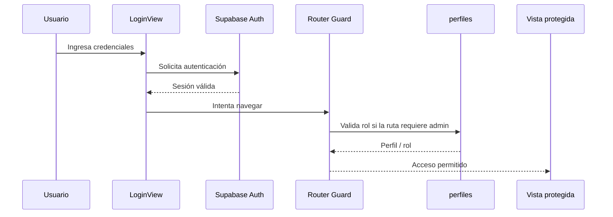

# FRONTEND_ARCHITECTURE.md

## Arquitectura de Frontend — InfoGastos Districorr

**Versión:** 1.0  
**Fecha de consolidación:** 2026-05-12  
**Propósito:** documentar la estructura del frontend, sus vistas, componentes, composables, rutas, responsabilidades, puntos críticos y su relación con el backend Supabase.

---

## 1. Objetivo del documento

Este archivo funciona como **fuente de verdad de la arquitectura frontend** de InfoGastos Districorr.

Debe consultarse antes de:

- crear nuevas vistas o rutas;
- agregar componentes reutilizables;
- modificar formularios críticos;
- tocar la navegación, autenticación o permisos de interfaz;
- integrar nuevas RPCs, vistas o flujos de Supabase;
- refactorizar módulos existentes;
- diseñar nuevas features bajo metodología Spec-Driven.

---

## 2. Stack tecnológico

| Categoría | Tecnología | Uso principal |
| --- | --- | --- |
| Framework | Vue.js 3 | Construcción de la interfaz |
| API de Vue | Composition API | Organización de lógica reactiva |
| Bundler | Vite | Desarrollo, build y HMR |
| Routing | Vue Router 4 | Navegación y guards |
| Estilos | Tailwind CSS | Diseño utilitario y consistencia visual |
| Backend client | `@supabase/supabase-js` | Auth, consultas, RPCs |
| Gráficos | Chart.js + vue-chartjs | KPIs, analytics |
| Mapas | Leaflet + `@vue-leaflet/vue-leaflet` | Análisis geográfico |
| PDFs | jsPDF + jspdf-autotable | Reportes descargables |
| Excel | xlsx | Exportaciones `.xlsx` |
| Selectores avanzados | vue-select | Búsqueda, selección y alta “al vuelo” |

---

## 3. Principios arquitectónicos del frontend

### 3.1. Frontend como capa de experiencia, no de negocio central

El frontend:

- compone pantallas y flujos;
- valida interacción básica;
- prepara payloads;
- consume tablas, vistas y RPCs;
- genera ciertos artefactos del lado cliente, como PDFs y Excel.

La lógica crítica debe permanecer en backend cuando implique:

- seguridad;
- permisos;
- consistencia de datos;
- aprobación/rechazo;
- ajustes de saldo;
- delegaciones;
- reportes consolidados;
- operaciones atómicas.

### 3.2. Separación por nivel de responsabilidad

| Nivel | Carpeta / archivo | Responsabilidad |
| --- | --- | --- |
| Entrada de app | `main.js` | Inicialización global |
| Raíz visual | `App.vue` | Layout superior y `<router-view>` |
| Navegación | `router/index.js` | Rutas, guards, lazy loading |
| Páginas | `src/views/` | Pantallas completas |
| UI reutilizable | `src/components/` | Componentes de interacción y presentación |
| Lógica reutilizable | `src/composables/` | Casos de lógica compartida |
| Funciones puras | `src/utils/` | Formatters y utilidades generales |

---

## 4. Estructura general del frontend

```txt
src/
├── assets/
│   └── Recursos visuales, imágenes y activos estáticos
│
├── components/
│   ├── Componentes reutilizables del flujo general
│   └── admin/
│       └── Componentes específicos del área administrativa y analítica
│
├── composables/
│   ├── useReportGenerator.js
│   ├── useExcelExporter.js
│   └── Otros composables específicos si existen en la versión actual
│
├── router/
│   └── index.js
│
├── utils/
│   └── formatters.js
│
├── views/
│   ├── LoginView.vue
│   ├── DashboardView.vue
│   ├── ViajesListView.vue
│   ├── GastosListView.vue
│   ├── GastoFormView.vue
│   ├── CajaDiariaView.vue
│   ├── GastosDelegadosView.vue
│   ├── PerfilView.vue
│   ├── PerfilConfigReporteView.vue
│   └── admin/
│       ├── AdminLayout.vue
│       ├── AdminDashboardView.vue
│       ├── AdminTiposGastoGlobalesView.vue
│       ├── AdminAnalyticsView.vue
│       └── AdminTransportesView.vue
│
├── App.vue
└── main.js
```

> Nota: esta estructura refleja la arquitectura documentada y los módulos identificados. El repositorio real puede contener archivos adicionales no listados aquí, especialmente dentro de `components/admin/` y `composables/`.

---

## 5. Arranque de la aplicación y ciclo de autenticación

### 5.1. `main.js`

**Rol:** punto de entrada global.

Responsabilidades conocidas:

1. Crear la instancia de Vue.
2. Registrar Vue Router.
3. Inicializar configuraciones globales.
4. Resolver correctamente el estado de autenticación antes de montar la aplicación.
5. Aplicar correcciones globales de librerías si corresponde, como la compatibilidad de íconos Leaflet en Vite.

### 5.2. `App.vue`

**Rol:** componente raíz.

Responsabilidades:

- envolver toda la aplicación;
- renderizar navegación global;
- mostrar `<router-view>`;
- condicionar elementos visibles según sesión autenticada;
- operar como capa superior de layout.

### 5.3. `router/index.js`

**Rol:** definición de rutas y control de acceso.

Patrones documentados:

- uso de **lazy loading** con `() => import(...)`;
- rutas públicas como `/login`;
- rutas autenticadas de usuario;
- rutas administrativas anidadas bajo `/admin`;
- guards globales con `beforeEach`;
- control por meta fields, por ejemplo:
  - `requiresAuth`
  - `requiresAdmin`

### 5.4. Flujo de autenticación y autorización



---

## 6. Mapa de vistas principales

### 6.1. `LoginView.vue`

| Campo | Descripción |
| --- | --- |
| Propósito | Acceso al sistema |
| Componentes asociados | `LoginForm.vue` |
| Backend | Supabase Auth |
| Riesgos | Mensajes de error, sesión, redirecciones |

---

### 6.2. `DashboardView.vue`

| Campo | Descripción |
| --- | --- |
| Propósito | Resumen inicial del usuario autenticado |
| Contenido | KPIs o accesos principales |
| Backend | Consultas específicas según implementación |
| Estado | Funcionalmente definido; alcance exacto depende del repositorio |

---

### 6.3. `ViajesListView.vue`

| Campo | Descripción |
| --- | --- |
| Propósito | Panel principal de rendiciones |
| Entidad central | `viajes` |
| Funciones | Crear rendición, listar, filtrar, editar, cerrar/enviar, generar reportes |
| Backend | Tabla `viajes`, RPCs/reportes asociados |
| Conexiones importantes | `get_reporte_rendicion_completa(...)`, configuración de reportes |

#### Responsabilidades clave

- Mostrar rendiciones abiertas y cerradas.
- Exponer alertas visuales sobre estado o saldos.
- Permitir navegación hacia gastos asociados.
- Permitir generar reporte PDF de una rendición.
- Encadenar cierre de rendición y posterior proceso de aprobación.

---

### 6.4. `GastosListView.vue`

| Campo | Descripción |
| --- | --- |
| Propósito | Visualizar gastos de una rendición |
| Entidad central | `gastos` |
| Funciones | Listar, agrupar, desagrupar, editar, eliminar/solicitar eliminación, navegación móvil |
| Dependencias | `grupos_gastos`, tipos de gasto, reglas de estado |
| Riesgo | Componente de alta complejidad |

#### Responsabilidades clave

- Mostrar gastos individuales.
- Agrupar gastos según lógica del producto.
- Gestionar acciones por ítem.
- Interactuar con estados de rendición.
- Adaptar presentación a móvil.

#### Punto de refactor potencial

Este componente concentra varias responsabilidades:

- lectura de datos;
- lógica de agrupación;
- interacción de UI;
- edición/acciones;
- estado visual.

Conviene considerar extracción futura de:

- `useGastoGrouping`
- `useGastoSelection`
- `useGastoActions`

---

### 6.5. `GastoFormView.vue`

| Campo | Descripción |
| --- | --- |
| Propósito | Vista contenedora de alta/edición de gasto |
| Componente principal | `GastoForm.vue` |
| Backend | Inserciones/actualizaciones sobre `gastos` y flujos relacionados |
| Riesgo | Alta carga de reglas de origen y comportamiento condicional |

---

### 6.6. `CajaDiariaView.vue`

| Campo | Descripción |
| --- | --- |
| Propósito | Panel de caja chica del usuario |
| Entidades | `cajas_chicas`, `movimientos_caja`, `solicitudes_reposicion` |
| Funciones | Ver saldo, registrar gasto, solicitar reposición, generar reporte, historial |
| Reportes | `get_reporte_caja_completo(...)` + generación PDF |

---

### 6.7. `GastosDelegadosView.vue`

| Campo | Descripción |
| --- | --- |
| Propósito | Bandeja de gastos delegados |
| Entidades | `gastos`, `historial_delegaciones` |
| Acciones | Aceptar o rechazar delegaciones |
| Backend | RPCs de aceptación/rechazo |
| Riesgo | Modifica ownership funcional del gasto |

---

### 6.8. `PerfilView.vue`

| Campo | Descripción |
| --- | --- |
| Propósito | Consulta y edición de datos del usuario |
| Entidad | `perfiles` |
| Vinculación | Acceso a configuración de reportes |

---

### 6.9. `PerfilConfigReporteView.vue`

| Campo | Descripción |
| --- | --- |
| Propósito | Crear y administrar plantillas personalizadas de reportes |
| Entidad | `reporte_rendicion_config` |
| Backend | `save_reporte_rendicion_config(...)` |
| Riesgo | Sincronización entre configuración y generador de PDF |

---

## 7. Vistas administrativas

### 7.1. `AdminLayout.vue`

| Campo | Descripción |
| --- | --- |
| Propósito | Layout base de sección administrativa |
| Estructura | Navegación lateral + `<router-view>` |
| Riesgo | Consistencia de navegación y composición visual admin |

---

### 7.2. `AdminDashboardView.vue`

| Campo | Descripción |
| --- | --- |
| Propósito | Panel ejecutivo inicial de administración |
| Contenido | KPIs y accesos directos |
| Backend | Agregaciones o consultas consolidadas según implementación |

---

### 7.3. `AdminTiposGastoGlobalesView.vue`

| Campo | Descripción |
| --- | --- |
| Propósito | Gestionar tipos de gasto globales |
| Entidades | `tipos_gasto_config`, `usuario_tipos_gasto_permitidos` |
| Funciones | CRUD de tipos y asignación de permisos a usuarios |
| Riesgo | Impacta disponibilidad de categorías en formularios |

---

### 7.4. `AdminAnalyticsView.vue`

| Campo | Descripción |
| --- | --- |
| Propósito | Centro de análisis administrativo |
| Composición | Navegación por pestañas |
| Tabs documentadas | `GastosAnalyticsTab.vue`, `RendicionesAnalyticsTab.vue`, `ExploracionAvanzadaTab.vue` |
| Backend | RPCs de análisis y lectura consolidada |

---

### 7.5. `AdminTransportesView.vue`

| Campo | Descripción |
| --- | --- |
| Propósito | Análisis geográfico y gestión de transportes |
| Tabs | Análisis general + gestión de transportes |
| Backend | `get_transporte_analisis_geografico(...)`, catálogo `transportes` |
| UI | Mapas Leaflet + gráficos/KPIs |

---

## 8. Componentes reutilizables principales

### 8.1. `GastoForm.vue`

**Rol:** uno de los componentes más críticos del sistema.

#### Responsabilidades

- Crear o editar gastos.
- Resolver el origen del gasto:
  - rendición;
  - caja chica;
  - delegación;
  - cuenta corriente de la empresa;
  - eventualmente vehículo/flota según evolución del módulo.
- Mostrar campos condicionales por tipo de gasto.
- Manejar tipos de transporte.
- Crear entidades “al vuelo” como proveedor o localidad cuando el flujo lo permite.
- Preparar payloads hacia backend.

#### Flujo F-LOG-001: Cuenta Corriente de la Empresa

`GastoForm.vue` incorpora una cuarta opcion en el Paso 1 para registrar gastos a cuenta corriente de la empresa. Este flujo no solicita rendicion, caja diaria ni receptor de delegacion, y prepara el payload con:

- `origen_gasto = 'cuenta_corriente_empresa'`
- `estado_delegacion = 'directo'`
- `viaje_id = null`
- `caja_id = null`
- `vehiculo_id = null`

El flujo reutiliza la tabla `gastos` y no requiere nuevas rutas, componentes, tablas, columnas ni RPCs.

#### Riesgos

- Alto acoplamiento con:
  - `gastos`;
  - catálogos;
  - permisos;
  - reglas de exclusividad de origen;
  - RPCs de soporte.
- Debe revisarse cada vez que cambie:
  - el modelo `gastos`;
  - los formatos dinámicos;
  - el manejo de caja, transporte o delegaciones.

---

### 8.2. `TipoGastoSelector.vue`

| Campo | Descripción |
| --- | --- |
| Propósito | Selección visual de tipo de gasto |
| Fuente | `tipos_gasto_config` o permisos del usuario |
| UI | Botones/íconos configurables |
| Riesgo | Debe respetar disponibilidad real por permisos |

---

### 8.3. `HistorialMovimientosCaja.vue`

| Campo | Descripción |
| --- | --- |
| Propósito | Historial de operaciones de caja |
| Datos | movimientos, filtros, paginación |
| Backend | `movimientos_caja`, `movimientos_caja_detalle` |
| Acciones | Ver, editar o solicitar eliminación según caso |

---

### 8.4. `ReporteRendicion.vue`

| Campo | Descripción |
| --- | --- |
| Propósito | Vista previa HTML del reporte de rendición |
| Conexión | Datos obtenidos desde backend y configuración de reporte |
| Riesgo | Debe mantenerse consistente con PDF final |

---

### 8.5. `vue-select`

| Campo | Descripción |
| --- | --- |
| Propósito | Selectores avanzados |
| Uso | Búsqueda, selección, creación de valores cuando aplica |
| Impacto | Mejora UX en formularios con catálogos extensos |

---

## 9. Componentes administrativos identificados

A partir del estado documental y del changelog técnico del proyecto, se reconocen además componentes como:

| Componente | Rol |
| --- | --- |
| `AdminReportGenerator.vue` | Orquestación de reportes operativos |
| `ReportEmailModal.vue` | Modal de envío de reportes |
| `ReportScheduleDrawer.vue` | Programación/gestión de reportes |
| `ExploracionAvanzadaTab.vue` | Filtros complejos, resultados paginados y exportación |
| `GastosAnalyticsTab.vue` | Analítica de gastos |
| `RendicionesAnalyticsTab.vue` | Analítica de rendiciones |

> La presencia y versión exacta de estos archivos debe verificarse en el repositorio activo al iniciar una nueva feature.

---

## 10. Composables principales

### 10.1. `useReportGenerator.js`

**Rol:** centralizar la generación de PDFs del lado cliente.

Funciones documentadas:

| Función | Propósito |
| --- | --- |
| `generateCanvaStylePDF` | Reporte de rendición |
| `generateCajaReportePDF` | Reporte de caja chica |
| `getReportData` | Obtener/preparar datos de rendición |
| `generateAdminOperativoPDF` | Reportes operativos, según evolución del módulo |

#### Dependencias backend

- `get_reporte_rendicion_completa(...)`
- `get_reporte_caja_completo(...)`
- estructuras JSON específicas retornadas por RPCs

#### Riesgo de mantenimiento

A medida que crezcan los tipos de reportes, el composable puede convertirse en un “composable dios”. Se recomienda, si continúa creciendo, separar:

- `useRendicionReport`
- `useCajaReport`
- `useAdminReport`
- helpers base de PDF

---

### 10.2. `useExcelExporter.js`

**Rol:** transformar datos JSON en archivos `.xlsx`.

Usos conocidos:

- exportación desde Exploración Avanzada;
- potencial reutilización en reportes operativos.

---

### 10.3. `useAdminReports.js`

**Rol:** orquestar reportes operativos administrativos.

Responsabilidades documentadas:

- gestionar filtros;
- obtener datos del período actual;
- obtener período de comparación;
- calcular KPIs derivados;
- preparar agrupaciones para tablas;
- exponer acciones de exportación/envío/programación.

---

## 11. Utilidades

### 11.1. `formatters.js`

| Función esperada | Propósito |
| --- | --- |
| Formateo de fechas | Consistencia visual |
| Formateo monetario | Presentación uniforme de montos |

Estas utilidades reducen repetición y ayudan a mantener una representación consistente en UI, tablas y reportes.

---

## 12. Rutas y navegación

### 12.1. Tipos de rutas

| Tipo | Ejemplos |
| --- | --- |
| Públicas | `/login` |
| Autenticadas | `/`, `/viajes`, `/caja`, `/perfil` |
| Administrativas | `/admin/...` |

### 12.2. Reglas esperadas

- Rutas públicas accesibles sin sesión.
- Rutas internas con `requiresAuth`.
- Rutas admin con `requiresAdmin`.
- Redirección a login si no hay sesión.
- Redirección a dashboard u otra vista válida si el usuario no cumple rol.

---

## 13. Relación con backend

El frontend se conecta con Supabase de cuatro formas principales:

| Mecanismo | Uso |
| --- | --- |
| Auth | Login, sesión, identidad |
| Tablas directas | CRUD simple y lecturas autorizadas por RLS |
| Views | Lecturas consolidadas o simplificadas |
| RPCs | Operaciones de negocio, reportes y análisis complejos |

### 13.1. Ejemplos de backend por módulo

| Módulo | Backend principal |
| --- | --- |
| Rendiciones | `viajes`, `aprobar_rechazar_rendicion(...)` |
| Gastos | `gastos`, RPCs de delegación, duplicados y filtros |
| Caja chica | `cajas_chicas`, `movimientos_caja`, `ajustar_saldo_caja_manual(...)` |
| Reportes | `get_reporte_rendicion_completa(...)`, `get_reporte_caja_completo(...)` |
| Analytics | `filtrar_gastos_admin(...)` |
| Transportes | `get_transporte_analisis_geografico(...)` |
| Configuración | `reporte_rendicion_config`, `save_reporte_rendicion_config(...)` |

---

## 14. Patrones de UI y composición

### 14.1. Contenedor + subcomponentes

Ejemplos:

- `AdminAnalyticsView.vue` como contenedor de tabs.
- `CajaDiariaView.vue` integrando historial y acciones.
- `ViajesListView.vue` como panel de operación de rendiciones.

### 14.2. Componentes con lógica compleja

Deben mantenerse vigilados:

- `GastoForm.vue`
- `GastosListView.vue`
- `ExploracionAvanzadaTab.vue`
- `useReportGenerator.js`
- `useAdminReports.js`

### 14.3. Estado global acotado

La arquitectura documentada sugiere un frontend sin store global masivo, apoyándose en:

- estado local de vistas;
- props;
- composición;
- datos del usuario autenticado;
- lectura directa o RPC al backend.

---

## 15. Riesgos y deuda técnica frontend

### 15.1. Componentes de alta responsabilidad

| Pieza | Riesgo |
| --- | --- |
| `GastoForm.vue` | Mucha lógica condicional y alta sensibilidad a cambios de negocio |
| `GastosListView.vue` | Multiplicidad de acciones, agrupaciones y comportamiento visual |
| `ExploracionAvanzadaTab.vue` | Acople a filtros complejos y RPC crítica |
| `useReportGenerator.js` | Puede crecer excesivamente |
| `useAdminReports.js` | Depende de shapes de datos y filtros administrativos |

### 15.2. Acoplamiento a firmas de RPC

Cambios en:

- `filtrar_gastos_admin(...)`
- `get_reporte_rendicion_completa(...)`
- `get_reporte_caja_completo(...)`

pueden romper:

- tablas;
- filtros;
- exportaciones;
- reportes PDF;
- reportes operativos.

### 15.3. Riesgo de inconsistencias de nombres

Se detectó como patrón de riesgo la diferencia entre:

- columnas reales de base;
- alias de views;
- parámetros de RPC;
- nombres utilizados en frontend.

Ejemplo conceptual:

- `gastos.user_id`
- alias tipo `gasto_user_id`
- parámetro tipo `p_responsable_id`

Esto requiere especial cuidado al construir filtros y exports.

---

## 16. Guía para crear nuevas features frontend

Antes de implementar una nueva feature:

1. Leer `AI_WORKING_CONTEXT.md`.
2. Leer `PROJECT_CONTEXT_MASTER.md`.
3. Consultar la Spec correspondiente.
4. Identificar:
   - vista nueva o existente;
   - componente nuevo o existente;
   - datos requeridos;
   - RPC o tabla backend;
   - cambios de rutas;
   - permisos de UI.
5. Revisar:
   - `FRONTEND_BACKEND_DATA_FLOW.md`
   - `SUPABASE_RPCS_VIEWS_TRIGGERS_CATALOG.md`
   - `SUPABASE_RLS_SECURITY_MATRIX.md`
6. Evitar duplicar lógica si ya existe un composable reutilizable.
7. Actualizar esta documentación si se agrega:
   - nueva vista;
   - nuevo composable;
   - nuevo patrón arquitectónico;
   - nueva dependencia frontend.

---

## 17. Checklist de revisión para cambios frontend

| Pregunta | Sí / No |
| --- | --- |
| ¿La feature requiere ruta nueva? |  |
| ¿La ruta necesita `requiresAuth` o `requiresAdmin`? |  |
| ¿Se reutiliza un componente existente? |  |
| ¿Se necesita nuevo composable? |  |
| ¿La UI consume tabla, view o RPC? |  |
| ¿El backend ya está documentado? |  |
| ¿Se respetan formatos y utilidades existentes? |  |
| ¿Se verificó responsive móvil? |  |
| ¿Se actualizó documentación? |  |

---

## 18. Conclusión

El frontend de InfoGastos está organizado alrededor de:

- vistas funcionales claras;
- componentes reutilizables;
- composables para lógica compartida;
- integración directa con Supabase;
- backend fuerte para operaciones sensibles.

La arquitectura es adecuada para seguir escalando, pero requiere especial disciplina en:

- componentes grandes;
- dependencia de RPCs;
- reportes;
- flujos de delegación;
- administración y analytics;
- sincronización entre documentación, código y base de datos.

Este documento debe mantenerse actualizado como **fuente maestra de arquitectura frontend**.
