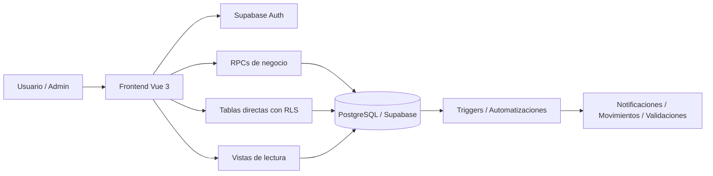
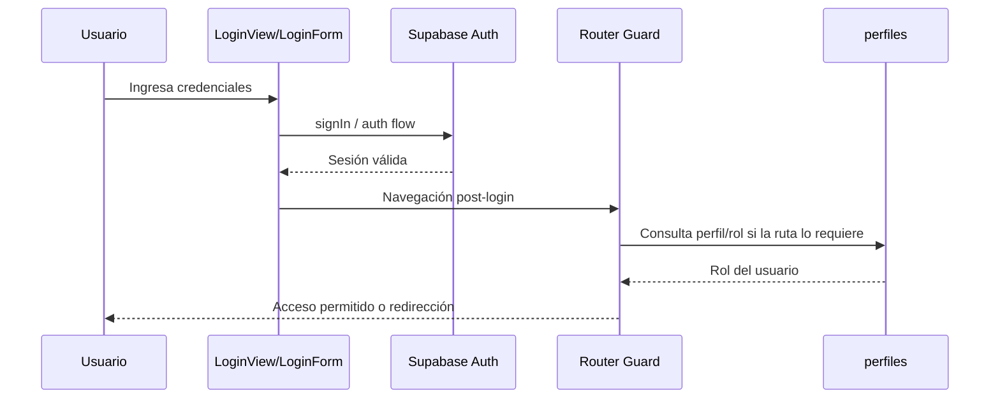
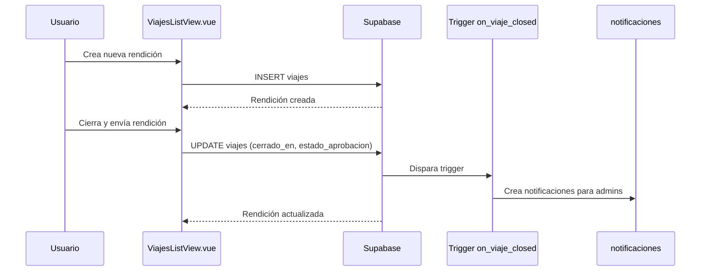
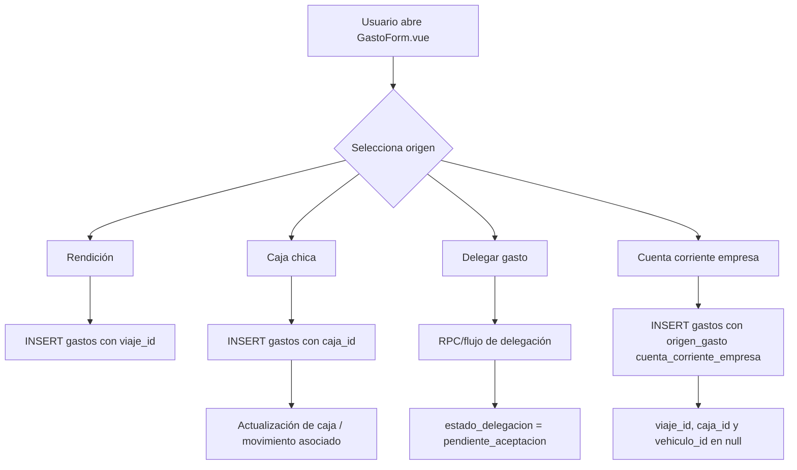
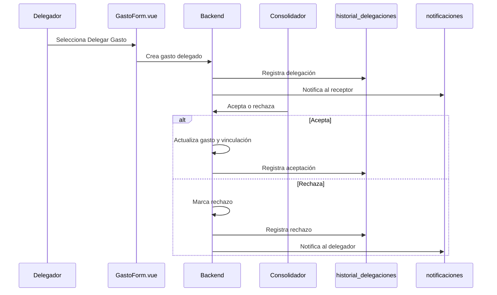
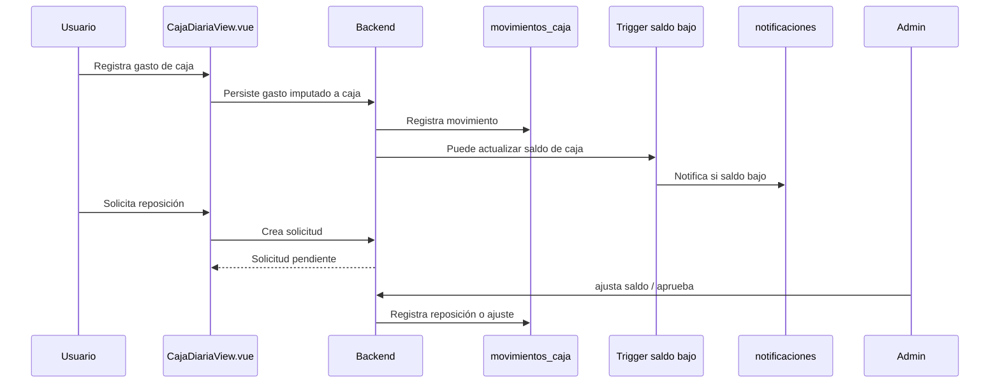
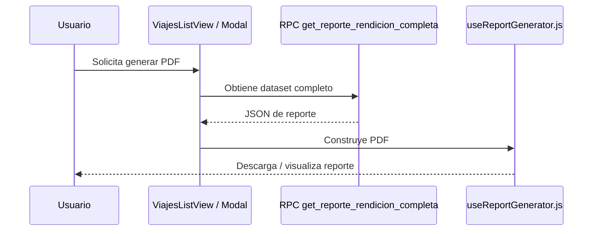
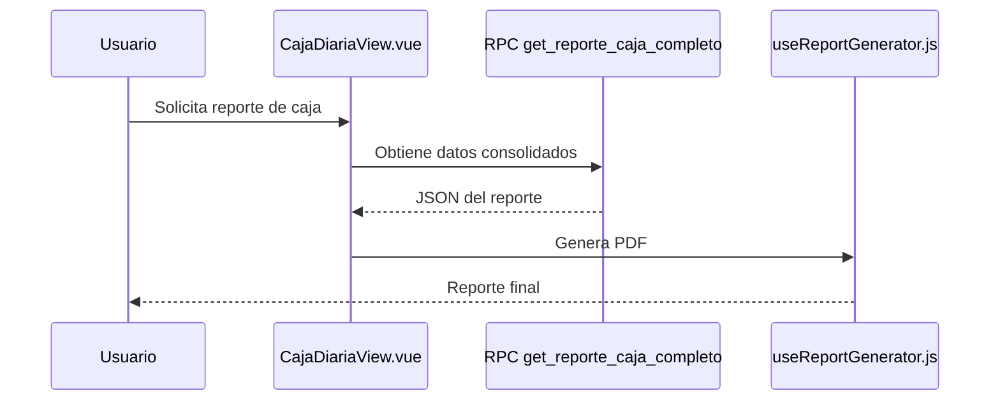

# FRONTEND_BACKEND_DATA_FLOW.md

## Flujo de Datos Frontend ↔ Backend — InfoGastos Districorr

**Versión:** 1.0  
**Fecha de consolidación:** 2026-05-12  
**Objetivo:** documentar cómo las acciones de usuario en el frontend se conectan con Supabase mediante tablas, vistas, RPCs, triggers y reportes.

---

## 1. Alcance y criterio de lectura

Este documento conecta:

- **Vistas y componentes Vue**
- **Acciones de usuario**
- **Consultas, RPCs y tablas de Supabase**
- **Efectos persistidos en base de datos**
- **Triggers o automatizaciones asociadas**
- **Nivel de verificación disponible**

### Niveles de verificación usados

| Nivel | Significado |
| --- | --- |
| **Confirmado por documentación funcional/técnica** | El flujo aparece explícitamente documentado en los archivos de arquitectura, negocio o backend. |
| **Confirmado por esquema/RPC catalogado** | El objeto backend existe y fue verificado mediante exports SQL/Supabase consolidados en la documentación técnica. |
| **Parcial / a verificar en código** | El flujo es coherente con la arquitectura y objetos backend, pero la llamada exacta desde un componente requiere revisar el repositorio fuente. |

> Este documento no reemplaza una revisión línea por línea del código frontend. Su función es dejar un **mapa técnico-operativo confiable** de las conexiones principales del sistema.

---

## 2. Arquitectura resumida de interacción



### Principio general del proyecto

- El frontend actúa como **orquestador de experiencia de usuario**.
- La base de datos y las RPCs concentran **reglas de negocio, integridad, seguridad y cálculos complejos**.
- Las vistas resuelven lecturas consolidadas.
- Los triggers automatizan eventos como notificaciones o validaciones contextuales.

---

## 3. Mapa maestro de flujos

| Módulo | Vista / Componente | Acción del usuario | Backend invocado | Tablas / Vistas afectadas | Resultado | Verificación |
| --- | --- | --- | --- | --- | --- | --- |
| Autenticación | `LoginView.vue` / `LoginForm.vue` | Iniciar sesión | Supabase Auth | `auth.users`, lectura de `perfiles` | Sesión activa y perfil disponible | Confirmado por documentación frontend |
| Navegación protegida | `router/index.js` | Acceder a ruta autenticada / admin | Consulta de rol/perfil | `perfiles` | Permite o bloquea navegación | Confirmado por documentación frontend |
| Dashboard | `DashboardView.vue` | Consultar resumen inicial | Consultas/RPCs no detalladas | Módulos de gastos/rendiciones según implementación | KPIs/resumen | Parcial / a verificar en código |
| Rendiciones | `ViajesListView.vue` | Ver rendiciones propias | Lectura de tabla / consultas filtradas | `viajes` | Lista de rendiciones | Confirmado funcionalmente; llamada exacta a verificar |
| Rendiciones | `ViajesListView.vue` | Crear rendición | `INSERT` sobre tabla o lógica equivalente | `viajes` | Nueva rendición en estado inicial | Confirmado por flujo funcional |
| Rendiciones | `ViajesListView.vue` | Cerrar y enviar rendición | `UPDATE viajes` | `viajes` | `cerrado_en` y estado de aprobación actualizado | Confirmado por flujo funcional |
| Rendiciones | Backend asociado | Cierre de rendición | Trigger `on_viaje_closed` | `viajes`, `notificaciones` | Notifica a administradores | Confirmado por documentación backend |
| Gastos por rendición | `GastosListView.vue` | Ver gastos de una rendición | Lecturas directas / vistas específicas | `gastos`, `grupos_gastos` | Tabla/listado de gastos | Confirmado funcionalmente |
| Gastos | `GastoFormView.vue` + `GastoForm.vue` | Crear gasto asociado a rendición | `INSERT` / lógica controlada | `gastos` con `viaje_id` | Nuevo gasto asociado a viaje | Confirmado funcionalmente |
| Gastos | `GastoForm.vue` | Crear gasto imputado a caja | `INSERT` / lógica backend asociada | `gastos`, `cajas_chicas`, `movimientos_caja` | Gasto de caja y movimiento contable | Confirmado funcionalmente |
| Gastos | `GastoForm.vue` | Delegar gasto | RPC de delegación / flujo específico | `gastos`, `historial_delegaciones`, `notificaciones` | Gasto pendiente de aceptación | Confirmado funcionalmente; RPC exacta detallada en catálogo |
| Gastos | `GastoForm.vue` | Registrar gasto a cuenta corriente de la empresa | `INSERT gastos` directo | `gastos` con `origen_gasto = 'cuenta_corriente_empresa'` y sin `viaje_id`, `caja_id` ni `vehiculo_id` | Gasto operativo no imputado a rendicion, caja ni delegacion | Confirmado por implementacion frontend F-LOG-001 |
| Delegaciones | `GastosDelegadosView.vue` | Aceptar gasto delegado | `aceptar_gasto_delegado(...)` | `gastos`, `historial_delegaciones` | Gasto pasa al consolidador y/o rendición activa | Confirmado funcionalmente |
| Delegaciones | `GastosDelegadosView.vue` | Rechazar gasto delegado | `rechazar_gasto_delegado(...)` | `gastos`, `historial_delegaciones`, `notificaciones` | Gasto vuelve o queda rechazado | Confirmado funcionalmente |
| Caja diaria | `CajaDiariaView.vue` | Ver saldo y movimientos | Lecturas / RPC de reporte | `cajas_chicas`, `movimientos_caja`, `movimientos_caja_detalle` | Estado de caja y movimientos | Confirmado funcionalmente |
| Caja diaria | `HistorialMovimientosCaja.vue` | Consultar historial filtrado/paginado | Lectura backend | `movimientos_caja`, vista `movimientos_caja_detalle` | Historial operativo | Confirmado por arquitectura/documentación |
| Caja diaria | `CajaDiariaView.vue` | Solicitar reposición | RPC o `INSERT` asociado | `solicitudes_reposicion`, `notificaciones` | Solicitud pendiente | Confirmado funcionalmente |
| Caja diaria | Admin | Aprobar/ajustar reposición | `ajustar_saldo_caja_manual(...)` | `cajas_chicas`, `movimientos_caja`, `solicitudes_reposicion` | Saldo actualizado y movimiento registrado | Confirmado por documentación backend |
| Caja diaria | Backend asociado | Saldo bajo | Trigger `trg_caja_saldo_bajo` | `cajas_chicas`, `notificaciones` | Notificación al responsable | Confirmado por documentación backend |
| Reporte de rendición | `ViajesListView.vue` / modal de vista previa | Generar PDF de rendición | `get_reporte_rendicion_completa(...)` + `useReportGenerator.js` | `viajes`, `gastos`, agrupaciones y configuración de reporte | PDF de rendición | Confirmado por documentación backend/frontend |
| Reporte de caja | `CajaDiariaView.vue` | Generar reporte de caja | `get_reporte_caja_completo(...)` + `useReportGenerator.js` | `cajas_chicas`, `movimientos_caja`, vista `movimientos_caja_detalle` | PDF de caja | Confirmado por documentación backend/frontend |
| Configuración de reportes | `PerfilConfigReporteView.vue` | Crear/editar plantilla | `save_reporte_rendicion_config(...)` | `reporte_rendicion_config` | Plantilla persistida | Confirmado por documentación backend |
| Configuración de reportes | `PerfilView.vue` | Acceder a configuración | Lectura de configs | `reporte_rendicion_config` | Lista de plantillas | Confirmado funcionalmente |
| Admin — tipos de gasto | `AdminTiposGastoGlobalesView.vue` | CRUD de tipos de gasto | Operaciones sobre catálogo / RPCs auxiliares | `tipos_gasto_config` | Catálogo actualizado | Confirmado por arquitectura |
| Admin — permisos por tipo de gasto | `AdminTiposGastoGlobalesView.vue` | Asignar tipos permitidos a usuario | Persistencia en pivote | `usuario_tipos_gasto_permitidos` | Permisos actualizados | Confirmado por arquitectura |
| Analítica admin | `AdminAnalyticsView.vue` → `ExploracionAvanzadaTab.vue` | Filtrar gastos | `filtrar_gastos_admin(...)` | Vista `admin_gastos_completos` | Resultados paginados y total | Confirmado por documentación backend |
| Analítica admin | `ExploracionAvanzadaTab.vue` | Exportar resultados a Excel | `filtrar_gastos_admin(...)` + `useExcelExporter.js` | `admin_gastos_completos` | `.xlsx` exportado | Confirmado por documentación frontend |
| Reportes operativos | `AdminReportGenerator.vue` + `useAdminReports.js` | Consultar período / KPIs | `filtrar_gastos_admin(...)` | Vista `admin_gastos_completos` | KPIs, tablas y comparativas | Confirmado por changelog/documentación |
| Transportes | `AdminTransportesView.vue` | Ver análisis geográfico | `get_transporte_analisis_geografico(...)` | Gasto/transporte/geografía | KPIs, agregados y mapa | Confirmado por documentación backend |
| Transportes | `AdminTransportesView.vue` | Gestionar transportes | CRUD de catálogo | `transportes` | Catálogo de transportes actualizado | Confirmado por arquitectura |
| Flota | Vistas de flota / módulo iniciado | Registrar combustible | RPCs específicas / tablas | `vehiculos`, `registros_combustible` | Registro de carga | Parcial / sujeto al estado real del módulo |
| Flota | Vistas de flota / módulo iniciado | Consultar vehículo y combustible | Consultas/RPCs de flota | `vehiculos`, `vehiculo_asignaciones`, `registros_combustible` | Panel o historial | Parcial / sujeto al estado real del módulo |
| Notificaciones | Layout / header o componente de alertas | Mostrar notificaciones | Lectura directa/RPC | `notificaciones` | Alertas al usuario | Confirmado por backend; ubicación UI a verificar |

---

## 4. Flujo detallado: autenticación y autorización



### Objetos implicados

- `main.js`
- `App.vue`
- `router/index.js`
- `perfiles`

### Rol del backend

- Supabase Auth resuelve identidad.
- `perfiles` complementa con rol y datos de aplicación.
- El router usa esta información para permitir o impedir rutas protegidas.

---

## 5. Flujo detallado: rendiciones



### Tablas y objetos

| Objeto | Rol |
| --- | --- |
| `viajes` | Entidad principal de la rendición |
| `gastos` | Gastos asociados |
| `historial_aprobaciones_rendicion` | Auditoría de decisiones admin |
| `notificaciones` | Aviso a administradores al cierre |
| `aprobar_rechazar_rendicion(...)` | Acción administrativa sobre la rendición |

### Flujo admin asociado

| Acción | Backend esperado | Resultado |
| --- | --- | --- |
| Aprobar rendición | `aprobar_rechazar_rendicion(...)` | Rendición aprobada y auditada |
| Rechazar rendición | `aprobar_rechazar_rendicion(...)` | Rendición rechazada con motivo y posibilidad de corrección |

---

## 6. Flujo detallado: alta de gasto



### Componentes implicados

- `GastoFormView.vue`
- `GastoForm.vue`
- `TipoGastoSelector.vue`
- `v-select`
- utilidades de creación “al vuelo” para entidades

### Entidades potencialmente afectadas

- `gastos`
- `viajes`
- `cajas_chicas`
- `movimientos_caja`
- `tipos_gasto_config`
- `clientes`
- `proveedores`
- `transportes`
- `localidades`
- `provincias`

### Flujo F-LOG-001: cuenta corriente de la empresa

Cuando el usuario selecciona `A Cuenta Corriente de la Empresa` en `GastoForm.vue`:

- no se renderiza selector de rendicion;
- no se renderiza selector de caja diaria;
- no se renderiza selector de usuario receptor de delegacion;
- el usuario puede avanzar al Paso 2 normalmente;
- el submit persiste en `gastos` sin invocar RPCs de caja ni delegacion.

Payload esperado:

| Campo | Valor |
| --- | --- |
| `origen_gasto` | `'cuenta_corriente_empresa'` |
| `estado_delegacion` | `'directo'` |
| `viaje_id` | `null` |
| `caja_id` | `null` |
| `vehiculo_id` | `null` |

### Observación técnica

El `CHECK` de origen en `gastos` confirma que el gasto puede quedar asociado a **como máximo un origen** entre viaje, caja o vehículo. Cualquier lógica de frontend/backend debe respetar esa exclusividad.

---

## 7. Flujo detallado: delegación de gastos



### Backend implicado

- `aceptar_gasto_delegado(...)`
- `rechazar_gasto_delegado(...)`
- `gastos`
- `historial_delegaciones`
- `notificaciones`

### Regla clave

El flujo mantiene trazabilidad entre:

- **quién creó** el gasto (`creado_por_id`);
- **quién lo termina rindiendo** (`user_id`);
- **qué decisión se tomó** en el historial de delegaciones.

---

## 8. Flujo detallado: caja chica



### Objetos implicados

| Objeto | Rol |
| --- | --- |
| `cajas_chicas` | Saldo, objetivo, umbral |
| `gastos` | Gasto asociado a caja |
| `movimientos_caja` | Libro contable de la caja |
| `solicitudes_reposicion` | Solicitudes del usuario |
| `ajustar_saldo_caja_manual(...)` | Aprobación o ajuste admin |
| `trg_caja_saldo_bajo` | Notificación automática por umbral |

---

## 9. Flujo detallado: reportes

### 9.1. Reporte de rendición



### 9.2. Reporte de caja



### 9.3. Configuración personalizada de reportes

| Acción | Backend | Persistencia |
| --- | --- | --- |
| Crear configuración | `save_reporte_rendicion_config(...)` | `reporte_rendicion_config` |
| Editar configuración | `save_reporte_rendicion_config(...)` | `reporte_rendicion_config` |
| Marcar default | misma RPC | índice único parcial por `user_id` |

---

## 10. Flujo detallado: administración y análisis

### 10.1. Exploración avanzada

| Elemento | Descripción |
| --- | --- |
| Vista / componente | `AdminAnalyticsView.vue` → `ExploracionAvanzadaTab.vue` |
| Backend | `filtrar_gastos_admin(...)` |
| Fuente consolidada | `admin_gastos_completos` |
| Resultado | Tabla paginada, filtros combinados, conteo total, exportación |

```mermaid
flowchart LR
    A[ExploracionAvanzadaTab.vue] --> B[filtrar_gastos_admin(...)]
    B --> C[admin_gastos_completos]
    C --> D[gastos + perfiles + viajes + clientes + proveedores + transportes + cajas]
    B --> E[Tabla / total / export]
```

### 10.2. Reportes operativos

| Elemento | Descripción |
| --- | --- |
| Componente | `AdminReportGenerator.vue` |
| Composable | `useAdminReports.js` |
| Backend | `filtrar_gastos_admin(...)` |
| Resultado | KPIs, tablas y procesamiento frontend adicional |

### 10.3. Análisis geográfico de transportes

| Elemento | Descripción |
| --- | --- |
| Vista | `AdminTransportesView.vue` |
| Backend | `get_transporte_analisis_geografico(...)` |
| Salida | KPIs + agregados por geografía para mapa Leaflet |

---

## 11. Catálogos, configuraciones y permisos

| Módulo | Vista / componente | Backend | Persistencia |
| --- | --- | --- | --- |
| Tipos de gasto | `AdminTiposGastoGlobalesView.vue` | CRUD / RPCs auxiliares | `tipos_gasto_config` |
| Permisos de tipos | Modal asociado en Admin Tipos | Asignación de permisos | `usuario_tipos_gasto_permitidos` |
| Formatos de gasto | Admin / configuración | CRUD | `formatos_gasto_config`, `campos_formato_config` |
| Permisos por formato | Admin | Asignación | `usuario_formatos_permitidos` |
| Clientes / Proveedores / Transportes | Varios formularios y vistas admin | Lecturas / creación al vuelo / CRUD | `clientes`, `proveedores`, `transportes` |
| Localidades / Provincias | Alta de gasto y transportes | Lecturas + creación al vuelo | `localidades`, `provincias` |

---

## 12. Módulo de flota

### Estado documental

El módulo de flota está soportado en el esquema por:

- `vehiculos`
- `vehiculo_asignaciones`
- `registros_combustible`
- `gastos.vehiculo_id`

La documentación funcional indica que existe una línea de crecimiento del módulo hacia dashboards, KPIs y mantenimiento, pero la cobertura de UI concreta debe revisarse contra el repositorio real.

### Flujos confirmados por backend

| Flujo | Objetos |
| --- | --- |
| Registrar carga de combustible | `registros_combustible`, `vehiculos`, `proveedores`, `perfiles` |
| Asociar gasto a vehículo | `gastos.vehiculo_id` |
| Asignar usuarios a vehículo | `vehiculo_asignaciones` |

---

## 13. Automatizaciones y efectos secundarios

| Disparador | Objeto | Efecto |
| --- | --- | --- |
| Cierre de rendición | Trigger `on_viaje_closed` | Notifica a administradores |
| Saldo bajo en caja | Trigger `trg_caja_saldo_bajo` | Notifica al responsable |
| Alta/edición de gasto con factura/proveedor | Trigger de duplicado contextual | Previene duplicados |
| Actualización de perfil | Trigger de restricciones previas | Aplica validaciones |

---

## 14. Riesgos de acoplamiento frontend ↔ backend

### 14.1. `filtrar_gastos_admin(...)`

Es un punto central porque alimenta:

- Exploración Avanzada
- Reportes Operativos
- Exportaciones

El cambio de firma o de estructura de retorno puede romper varias superficies a la vez.

### 14.2. `useReportGenerator.js`

Depende de la forma exacta de los JSON retornados por:

- `get_reporte_rendicion_completa(...)`
- `get_reporte_caja_completo(...)`

Si cambia el backend, debe actualizarse el generador de PDF.

### 14.3. Nombres divergentes entre tabla, vista y RPC

La documentación previa ya detectó que conceptos similares pueden recibir nombres distintos en cada capa, por ejemplo:

- `gastos.user_id`
- alias de vista como `gasto_user_id`
- parámetros de RPC como `p_responsable_id`

Esto aumenta el riesgo de errores al evolucionar filtros o joins.

### 14.4. Delegaciones y ownership

El flujo de delegación es sensible porque toca:

- `user_id`
- `creado_por_id`
- `estado_delegacion`
- historial
- notificaciones

Cualquier cambio exige revisar frontend, RPCs, RLS y reportes.

---

## 15. Checklist para futuras features

Antes de implementar una feature que toque frontend y backend, verificar:

1. ¿Qué vista o componente dispara la acción?
2. ¿La operación usa:
   - tabla directa,
   - view,
   - RPC,
   - trigger?
3. ¿Qué tablas se escriben?
4. ¿Qué vistas o reportes consumen esos datos luego?
5. ¿Existe RLS para la operación?
6. ¿La tabla o RPC está documentada en:
   - `DATABASE_SCHEMA_AND_RELATIONSHIPS_FINAL.md`
   - `SUPABASE_RPCS_VIEWS_TRIGGERS_CATALOG.md`
   - `SUPABASE_RLS_SECURITY_MATRIX.md`
7. ¿Debe actualizarse este documento al cerrar la feature?

---

## 16. Conclusión

InfoGastos sigue un patrón consistente:

- **Frontend modular en Vue**
- **Lecturas simples directas cuando corresponde**
- **Views para consolidación**
- **RPCs para lógica compleja y operaciones sensibles**
- **Triggers para automatizaciones**
- **RLS para proteger acceso directo en módulos clave**

Este documento deja mapeado el circuito principal de datos entre interfaz y backend, y debe funcionar como puente entre la documentación de arquitectura de frontend y la documentación técnica de Supabase.
