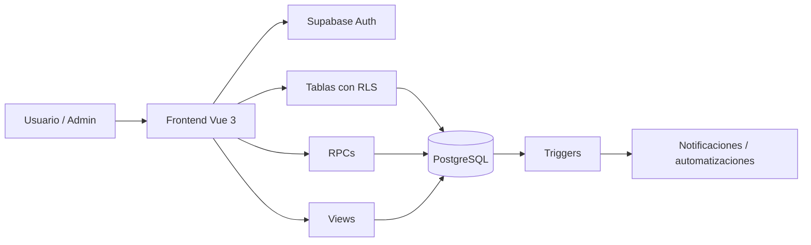

# PROJECT_CONTEXT_MASTER.md

## Documento Maestro del Proyecto — InfoGastos Districorr

**Versión:** 2.0  
**Fecha de actualización:** 2026-05-12  
**Estado:** Documento maestro consolidado con documentación técnica real de frontend, backend, esquema Supabase, RLS y flujos de datos.

---

## 1. Propósito de este documento

Este archivo es la **puerta de entrada oficial** al proyecto InfoGastos Districorr.  
Cualquier desarrollador, analista o agente de IA debe leerlo antes de:

- proponer features;
- tocar código frontend;
- modificar la base de datos;
- crear o alterar RPCs;
- revisar RLS;
- trabajar sobre reportes, analytics, gastos, rendiciones, caja chica o flota.

Este documento no reemplaza los archivos técnicos específicos, sino que los **ordena y contextualiza**.

---

## 2. Resumen ejecutivo

**InfoGastos Districorr** es una aplicación web interna orientada a digitalizar y centralizar:

- gastos operativos;
- rendiciones de viajes;
- caja chica;
- delegación de gastos;
- reportes PDF y Excel;
- análisis administrativo;
- análisis geográfico de transportes;
- configuración dinámica de formularios;
- permisos por usuario;
- base de gestión de flota y combustible.

El sistema reemplaza procesos manuales dispersos por una plataforma:

- auditable;
- trazable;
- segura;
- parametrizable;
- preparada para análisis y evolución operativa.

---

## 3. Estado actual del producto

InfoGastos ya posee una base funcional y técnica madura.  
No debe tratarse como un prototipo inicial, sino como un **producto interno en crecimiento**, con módulos centrales ya desarrollados y otros en consolidación.

### Núcleo implementado

| Módulo | Estado |
| --- | --- |
| Autenticación y perfiles | Implementado |
| Rendiciones | Implementado, sensible |
| Gastos | Implementado, sensible |
| Caja chica | Implementado, sensible |
| Delegación de gastos | Implementado, sensible |
| Reportes de rendición | Implementado, sensible |
| Reportes de caja | Implementado |
| Administración y analytics | Implementado, sensible |
| Transportes y análisis geográfico | Implementado |
| Configuración de formularios | Implementado |
| Configuración de reportes | Parcialmente implementada |
| Flota y combustible | Parcialmente implementado |
| Reportes operativos programados | Parcialmente implementados |

Para detalle completo, consultar:

- `CURRENT_IMPLEMENTATION_STATUS.md`

---

## 4. Usuarios y roles

### 4.1. Usuario común

Puede:

- crear rendiciones;
- cargar gastos;
- imputarlos a rendición o caja chica;
- delegar gastos;
- recibir gastos delegados;
- consultar su caja;
- generar reportes propios;
- gestionar ciertas configuraciones personales.

### 4.2. Consolidador

Es un usuario que recibe gastos delegados de otros y puede:

- aceptar o rechazar gastos delegados;
- incorporarlos a su circuito de rendición;
- mantener trazabilidad del origen del gasto.

### 4.3. Administrador

Puede:

- revisar rendiciones;
- aprobar o rechazar;
- analizar gastos consolidados;
- gestionar catálogos;
- administrar cajas chicas;
- administrar tipos y formatos permitidos;
- consultar reportes operativos;
- acceder a herramientas de analytics.

---

## 5. Módulos funcionales principales

### 5.1. Rendiciones

Una rendición agrupa gastos de un viaje o período.

Flujo central:

1. Usuario crea rendición.
2. Agrega gastos.
3. Cierra y envía.
4. Admin aprueba o rechaza.
5. El sistema mantiene trazabilidad y genera notificaciones.

### 5.2. Gastos

Es el núcleo operativo del sistema.  
Un gasto puede vincularse a:

- una rendición;
- una caja chica;
- un vehículo;
- un flujo de delegación.
- cuenta corriente de la empresa, para gastos operativos no imputados a rendicion, caja ni delegacion.

También puede relacionarse con:

- tipo de gasto;
- proveedor;
- cliente;
- transporte;
- geografía;
- formato configurable;
- agrupaciones internas.

### 5.3. Caja chica

Permite:

- administrar fondos operativos;
- registrar gastos;
- visualizar saldo;
- generar movimientos;
- solicitar reposiciones;
- aplicar ajustes por administración.

### 5.4. Delegación de gastos

Permite que un usuario cargue un gasto y otro lo rinda o gestione.

La trazabilidad se preserva mediante:

- `creado_por_id`;
- `user_id`;
- `estado_delegacion`;
- `historial_delegaciones`.

### 5.5. Analytics y administración

Incluye:

- exploración avanzada de gastos;
- filtros combinados;
- reportes operativos;
- KPIs;
- exportaciones;
- análisis geográfico de transportes.

### 5.6. Reportes

Incluye:

- PDF de rendición;
- PDF de caja;
- reportes operativos;
- configuración personalizada de reportes.

### 5.7. Flota y combustible

El backend soporta:

- vehículos;
- asignaciones;
- registros de combustible;
- vínculo de gastos con vehículos.

El módulo está en evolución y requiere cierre funcional adicional.

---

## 6. Stack tecnológico

### Frontend

- Vue.js 3
- Composition API
- Vite
- Vue Router
- Tailwind CSS
- Chart.js / vue-chartjs
- Leaflet / vue-leaflet
- jsPDF / jsPDF AutoTable
- xlsx
- vue-select

### Backend

- Supabase
- PostgreSQL
- Auth
- RLS
- RPCs
- Views
- Triggers
- Functions `SECURITY DEFINER` / `SECURITY INVOKER`

---

## 7. Arquitectura general

### Principio rector

El proyecto sigue un enfoque de:

> **Backend robusto + frontend modular y liviano.**

La lógica crítica debe concentrarse en backend cuando implique:

- integridad;
- permisos;
- operaciones atómicas;
- cálculos;
- aprobación;
- reportes consolidados;
- seguridad.

---

## 8. Base de datos — fotografía real consolidada

La documentación técnica actual confirma:

| Objeto | Cantidad |
| --- | ---: |
| Tablas públicas | 26 |
| Foreign Keys | 54 |
| Constraints | 108 |
| Índices | 56 |
| Views públicas | 9 |
| Funciones / RPCs públicas | 99 |
| Triggers públicos | 5 |
| Políticas RLS | 75 |

### Tablas más críticas

- `gastos`
- `viajes`
- `cajas_chicas`
- `movimientos_caja`
- `perfiles`
- `historial_delegaciones`
- `reporte_rendicion_config`
- `vehiculos`
- `registros_combustible`

Para detalle total:

- `DATABASE_SCHEMA_AND_RELATIONSHIPS_FINAL.md`

---

## 9. Backend Supabase — principios y puntos críticos

### 9.1. RPCs y views

Las RPCs son esenciales para:

- filtrar gastos;
- generar reportes;
- gestionar caja;
- delegar gastos;
- aprobar/rechazar;
- ejecutar lógica compleja.

Las views simplifican lecturas complejas, especialmente:

- `admin_gastos_completos`
- `movimientos_caja_detalle`

Para detalle:

- `SUPABASE_RPCS_VIEWS_TRIGGERS_CATALOG.md`

### 9.2. Seguridad RLS

La matriz consolidada confirma:

- 14 tablas con RLS habilitado;
- 12 tablas públicas sin RLS habilitado;
- 75 políticas activas;
- `perfiles` con RLS forzado.

Para detalle:

- `SUPABASE_RLS_SECURITY_MATRIX.md`

---

## 10. Flujo frontend ↔ backend

El vínculo entre UI y Supabase quedó consolidado en:

- `FRONTEND_BACKEND_DATA_FLOW.md`

Ese documento mapea:

- vista;
- acción;
- RPC o tabla;
- efectos en BD;
- triggers;
- dependencias.

---

## 11. Riesgos técnicos prioritarios

### Alta prioridad

1. **Sobrecarga de RPCs**
   - Especialmente `filtrar_gastos_admin(...)`.

2. **Complejidad de `gastos`**
   - Tabla central con alto acople.

3. **RLS redundante**
   - Especialmente en `gastos` y `viajes`.

4. **Tablas sin RLS**
   - Requieren auditoría de grants/exposición.

5. **Acople de reportes**
   - Frontend depende de shapes de JSON de RPCs.

6. **Módulos parciales**
   - reportes operativos;
   - configuración de reportes;
   - flota.

Para detalle:

- `TECHNICAL_RISKS_AND_REFACTOR_NOTES.md`

---

## 12. Convenciones de documentación y desarrollo

### 12.1. Spec-Driven Development

Toda feature mediana o grande debe contar con una Spec previa.

Documento guía:

- `SPEC_DRIVEN_DEVELOPMENT_GUIDE.md`

Template:

- `FEATURE_SPECS/TEMPLATE_FEATURE_SPEC.md`

### 12.2. Documentos que deben actualizarse luego de cambios relevantes

| Cambio | Documentación a actualizar |
| --- | --- |
| Modelo de datos | `DATABASE_SCHEMA_AND_RELATIONSHIPS_FINAL.md` |
| RPCs / views / triggers | `SUPABASE_RPCS_VIEWS_TRIGGERS_CATALOG.md` |
| RLS | `SUPABASE_RLS_SECURITY_MATRIX.md` |
| Flujo FE/BE | `FRONTEND_BACKEND_DATA_FLOW.md` |
| Estado del producto | `CURRENT_IMPLEMENTATION_STATUS.md` |
| Riesgos | `TECHNICAL_RISKS_AND_REFACTOR_NOTES.md` |
| Contexto maestro | `PROJECT_CONTEXT_MASTER.md` |
| Changelog | `CHANGELOG_TECHNICAL.md` |

---

## 13. Orden de lectura recomendado para una IA

1. `AI_WORKING_CONTEXT.md`
2. `PROJECT_CONTEXT_MASTER.md`
3. Spec de la feature
4. `CURRENT_IMPLEMENTATION_STATUS.md`
5. Documentación técnica específica según el área:
   - Frontend: `FRONTEND_ARCHITECTURE.md`
   - Modelo de datos: `DATABASE_SCHEMA_AND_RELATIONSHIPS_FINAL.md`
   - RPCs: `SUPABASE_RPCS_VIEWS_TRIGGERS_CATALOG.md`
   - RLS: `SUPABASE_RLS_SECURITY_MATRIX.md`
   - Flujo FE/BE: `FRONTEND_BACKEND_DATA_FLOW.md`

---

## 14. Estado de documentación disponible

| Documento | Estado |
| --- | --- |
| `PROJECT_CONTEXT_MASTER.md` | Actualizado |
| `BUSINESS_DOMAIN_AND_FLOWS.md` | Vigente |
| `FRONTEND_ARCHITECTURE.md` | Consolidado |
| `DATABASE_SCHEMA_AND_RELATIONSHIPS_FINAL.md` | Consolidado |
| `SUPABASE_RPCS_VIEWS_TRIGGERS_CATALOG.md` | Consolidado |
| `SUPABASE_RLS_SECURITY_MATRIX.md` | Consolidado |
| `FRONTEND_BACKEND_DATA_FLOW.md` | Consolidado |
| `CURRENT_IMPLEMENTATION_STATUS.md` | Consolidado |
| `TECHNICAL_RISKS_AND_REFACTOR_NOTES.md` | Actualizado |
| `OPEN_QUESTIONS_AND_VERIFICATION_PENDING.md` | Actualizado |
| `SPEC_DRIVEN_DEVELOPMENT_GUIDE.md` | Vigente |
| `AI_WORKING_CONTEXT.md` | Vigente |
| `CHANGELOG_TECHNICAL.md` | Vigente, requiere mantenimiento continuo |

---

## 15. Conclusión

InfoGastos Districorr es una plataforma interna con arquitectura ya significativa, dominio claro y backend avanzado.  
El proyecto cuenta ahora con una documentación técnica suficientemente sólida para:

- continuar el desarrollo con IA;
- reducir pérdida de contexto;
- tomar decisiones con mayor seguridad;
- evitar inventar relaciones, tablas o flujos;
- trabajar mediante especificaciones.

Este archivo debe mantenerse como **índice maestro y síntesis estratégica del proyecto**.
## 16.1. Actualizacion breve 2026-06-01
- F-LOG-002 implementada en UI admin de Encomiendas/Costos con RPC `admin_actualizar_gasto_cuenta_corriente` (sin `update` directo sobre `public.gastos`).
- F-LOG-003 implementada/avanzada para crear proveedor desde modal con RPC `admin_crear_proveedor_basico` (sin `insert` directo sobre `public.proveedores`) y autoseleccion del nuevo proveedor.
- Reporte Control de Encomiendas y Costos Logisticos ajustado para informar monto y cantidad de operaciones por modalidad de imputacion.
